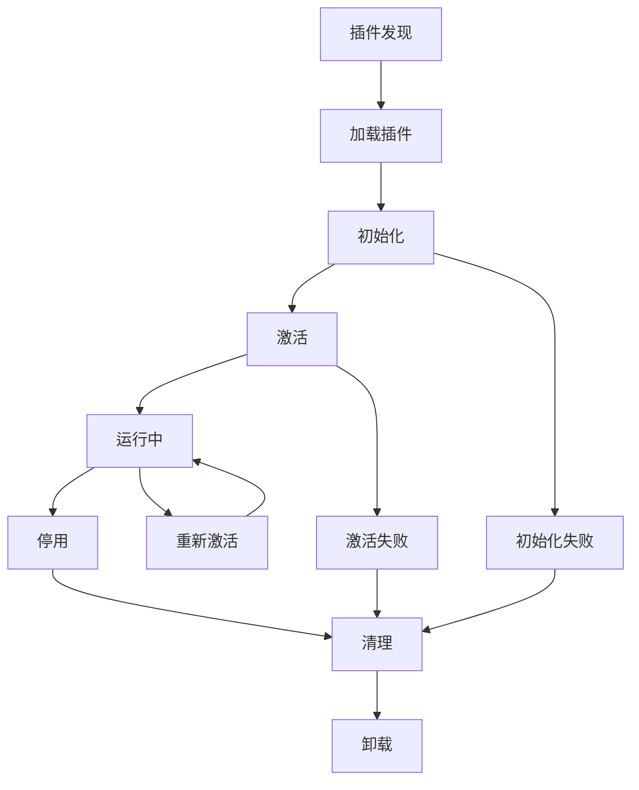

# TimeNest 插件开发指南

欢迎来到 TimeNest 插件开发指南！本文档将帮助您从零开始创建功能强大的 TimeNest 插件。

## 📋 目录

- [插件系统架构](#插件系统架构)
- [开发环境搭建](#开发环境搭建)
- [插件 API 接口](#插件-api-接口)
- [插件生命周期](#插件生命周期)
- [配置和数据存储](#配置和数据存储)
- [通信机制](#通信机制)
- [开发最佳实践](#开发最佳实践)
- [测试和调试](#测试和调试)
- [打包和发布](#打包和发布)
- [示例插件](#示例插件)
- [常见问题](#常见问题)

## 🏗️ 插件系统架构

### 核心组件

TimeNest 插件系统由以下核心组件构成：

```
┌─────────────────────────────────────────────────────────────┐
│                    TimeNest 主应用                          │
├─────────────────────────────────────────────────────────────┤
│  PluginManager (插件管理器)                                  │
│  ├── 插件加载和卸载                                          │
│  ├── 依赖关系管理                                            │
│  ├── 生命周期管理                                            │
│  └── 安全沙箱控制                                            │
├─────────────────────────────────────────────────────────────┤
│  PluginEventBus (事件总线)                                   │
│  ├── 事件发布和订阅                                          │
│  ├── 插件间通信                                              │
│  └── 主程序通信                                              │
├─────────────────────────────────────────────────────────────┤
│  PluginMarketplace (插件商城)                                │
│  ├── 插件发现和下载                                          │
│  ├── 版本管理                                                │
│  └── 自动更新                                                │
├─────────────────────────────────────────────────────────────┤
│                      插件实例                                │
│  ┌─────────────┐ ┌─────────────┐ ┌─────────────┐            │
│  │  组件插件   │ │  通知插件   │ │  主题插件   │            │
│  └─────────────┘ └─────────────┘ └─────────────┘            │
│  ┌─────────────┐ ┌─────────────┐ ┌─────────────┐            │
│  │  导出插件   │ │  集成插件   │ │  工具插件   │            │
│  └─────────────┘ └─────────────┘ └─────────────┘            │
└─────────────────────────────────────────────────────────────┘
```

### 插件类型

TimeNest 支持以下类型的插件：

| 类型 | 描述 | 示例 |
|------|------|------|
| **COMPONENT** | UI 组件插件 | 天气组件、倒计时组件 |
| **NOTIFICATION** | 通知插件 | 邮件通知、微信通知 |
| **THEME** | 主题插件 | 深色主题、节日主题 |
| **EXPORT** | 导出插件 | PDF 导出、Excel 导出 |
| **INTEGRATION** | 集成插件 | 钉钉集成、Teams 集成 |
| **UTILITY** | 工具插件 | 数据分析、备份工具 |

### 安全机制

- **沙箱隔离**：插件运行在受限环境中
- **权限控制**：细粒度的 API 访问权限
- **代码签名**：验证插件来源和完整性
- **资源限制**：限制内存和 CPU 使用

## 🛠️ 开发环境搭建

### 系统要求

- **Python**: 3.8 或更高版本
- **PyQt6**: 6.6.0 或更高版本
- **TimeNest**: 1.0.0 或更高版本

### 环境配置

1. **克隆开发模板**
   ```bash
   git clone https://github.com/ziyi127/TimeNest-Plugin-Template.git my-plugin
   cd my-plugin
   ```

2. **安装开发依赖**
   ```bash
   pip install -r requirements-dev.txt
   ```

3. **配置开发环境**
   ```bash
   # 创建插件开发目录
   mkdir -p ~/.timenest/plugins/my-plugin
   
   # 链接到开发目录（用于调试）
   ln -s $(pwd) ~/.timenest/plugins/my-plugin
   ```

### 开发工具

推荐使用以下开发工具：

- **IDE**: PyCharm、VS Code
- **调试器**: TimeNest Plugin Debugger
- **测试框架**: pytest
- **代码检查**: flake8、mypy
- **文档生成**: Sphinx

## 🔌 插件 API 接口

### 基础接口

所有插件必须继承 `IPlugin` 接口：

```python
from abc import ABC, abstractmethod
from core.plugin_base import IPlugin, PluginMetadata, PluginStatus

class MyPlugin(IPlugin):
    """我的插件"""
    
    def __init__(self):
        super().__init__()
        # 设置插件元数据
        self.metadata = PluginMetadata(
            id="my_plugin",
            name="我的插件",
            version="1.0.0",
            description="这是一个示例插件",
            author="Your Name",
            plugin_type=PluginType.UTILITY
        )
    
    def initialize(self, plugin_manager) -> bool:
        """初始化插件"""
        self.plugin_manager = plugin_manager
        self.logger.info("插件初始化完成")
        return True
    
    def activate(self) -> bool:
        """激活插件"""
        self.logger.info("插件已激活")
        return True
    
    def deactivate(self) -> bool:
        """停用插件"""
        self.logger.info("插件已停用")
        return True
    
    def cleanup(self) -> bool:
        """清理插件资源"""
        self.logger.info("插件资源已清理")
        return True
```

### 核心 API

#### 1. 应用管理器 API

```python
# 获取应用管理器
app_manager = self.plugin_manager.get_app_manager()

# 获取主窗口
main_window = app_manager.get_main_window()

# 获取系统托盘
system_tray = app_manager.get_system_tray()
```

#### 2. 配置管理 API

```python
# 获取配置管理器
config_manager = self.plugin_manager.get_config_manager()

# 读取配置
value = config_manager.get_config('key', default_value)

# 保存配置
config_manager.set_config('key', value)
```

#### 3. 通知系统 API

```python
# 获取通知管理器
notification_manager = self.plugin_manager.get_notification_manager()

# 发送通知
notification_manager.send_notification(
    title="插件通知",
    message="这是来自插件的通知",
    channels=['popup', 'sound']
)
```

#### 4. 事件系统 API

```python
# 获取事件总线
event_bus = self.plugin_manager.get_event_bus()

# 订阅事件
event_bus.subscribe('schedule_changed', self.on_schedule_changed)

# 发布事件
from core.plugin_system import PluginEvent
event = PluginEvent('my_event', {'data': 'value'}, self.metadata.id)
event_bus.publish(event)

def on_schedule_changed(self, event):
    """处理课程表变更事件"""
    self.logger.info(f"课程表已变更: {event.data}")
```

### UI 组件 API

#### 1. 浮窗组件

```python
from PyQt6.QtWidgets import QWidget, QLabel, QVBoxLayout

class MyFloatingWidget(QWidget):
    """自定义浮窗组件"""
    
    def __init__(self):
        super().__init__()
        self.setup_ui()
    
    def setup_ui(self):
        layout = QVBoxLayout()
        label = QLabel("我的插件组件")
        layout.addWidget(label)
        self.setLayout(layout)

# 在插件中注册组件
def activate(self) -> bool:
    floating_manager = self.plugin_manager.get_floating_manager()
    self.widget = MyFloatingWidget()
    floating_manager.add_component('my_plugin_widget', self.widget)
    return True
```

#### 2. 菜单项

```python
def activate(self) -> bool:
    # 添加菜单项
    main_window = self.plugin_manager.get_main_window()
    menu_bar = main_window.menuBar()
    
    # 创建插件菜单
    plugin_menu = menu_bar.addMenu("我的插件")
    
    # 添加动作
    action = plugin_menu.addAction("执行操作")
    action.triggered.connect(self.execute_action)
    
    return True

def execute_action(self):
    """执行插件动作"""
    self.logger.info("执行插件动作")
```

## 🔄 插件生命周期

### 生命周期阶段



### 生命周期方法

1. **initialize(plugin_manager)**: 插件初始化
   - 设置插件管理器引用
   - 初始化插件资源
   - 注册事件监听器
   - 返回 True 表示成功

2. **activate()**: 插件激活
   - 启动插件功能
   - 注册 UI 组件
   - 开始后台任务
   - 返回 True 表示成功

3. **deactivate()**: 插件停用
   - 停止后台任务
   - 移除 UI 组件
   - 保存状态数据
   - 返回 True 表示成功

4. **cleanup()**: 插件清理
   - 释放资源
   - 取消事件订阅
   - 清理临时文件
   - 返回 True 表示成功

### 状态管理

插件状态由 `PluginStatus` 枚举定义：

```python
class PluginStatus(Enum):
    UNKNOWN = "unknown"      # 未知状态
    LOADED = "loaded"        # 已加载
    ENABLED = "enabled"      # 已启用
    DISABLED = "disabled"    # 已禁用
    ERROR = "error"          # 错误状态
```

## 💾 配置和数据存储

### 插件配置

#### 1. 配置文件结构

```json
{
  "my_plugin": {
    "enabled": true,
    "settings": {
      "refresh_interval": 60,
      "show_notifications": true,
      "api_key": "your_api_key"
    },
    "ui": {
      "position": {"x": 100, "y": 100},
      "size": {"width": 200, "height": 150},
      "theme": "default"
    }
  }
}
```

#### 2. 配置管理

```python
class MyPlugin(IPlugin):
    def __init__(self):
        super().__init__()
        self.config = {}
    
    def initialize(self, plugin_manager) -> bool:
        self.plugin_manager = plugin_manager
        self.load_config()
        return True
    
    def load_config(self):
        """加载插件配置"""
        self.config = self.plugin_manager.get_plugin_config(self.metadata.id)
        
        # 设置默认值
        default_config = {
            'enabled': True,
            'refresh_interval': 60,
            'show_notifications': True
        }
        
        for key, value in default_config.items():
            if key not in self.config:
                self.config[key] = value
    
    def save_config(self):
        """保存插件配置"""
        self.plugin_manager.set_plugin_config(self.metadata.id, self.config)
    
    def get_setting(self, key: str, default=None):
        """获取设置值"""
        return self.config.get(key, default)
    
    def set_setting(self, key: str, value):
        """设置配置值"""
        self.config[key] = value
        self.save_config()
```

### 数据存储

#### 1. 本地数据存储

```python
import json
from pathlib import Path

class MyPlugin(IPlugin):
    def __init__(self):
        super().__init__()
        self.data_dir = Path.home() / '.timenest' / 'plugins' / 'my_plugin' / 'data'
        self.data_dir.mkdir(parents=True, exist_ok=True)
    
    def save_data(self, filename: str, data: dict):
        """保存数据到文件"""
        file_path = self.data_dir / filename
        with open(file_path, 'w', encoding='utf-8') as f:
            json.dump(data, f, ensure_ascii=False, indent=2)
    
    def load_data(self, filename: str) -> dict:
        """从文件加载数据"""
        file_path = self.data_dir / filename
        if file_path.exists():
            with open(file_path, 'r', encoding='utf-8') as f:
                return json.load(f)
        return {}
```

#### 2. 数据库存储

```python
import sqlite3
from pathlib import Path

class MyPlugin(IPlugin):
    def __init__(self):
        super().__init__()
        self.db_path = Path.home() / '.timenest' / 'plugins' / 'my_plugin' / 'data.db'
        self.init_database()
    
    def init_database(self):
        """初始化数据库"""
        self.db_path.parent.mkdir(parents=True, exist_ok=True)
        
        with sqlite3.connect(self.db_path) as conn:
            conn.execute('''
                CREATE TABLE IF NOT EXISTS plugin_data (
                    id INTEGER PRIMARY KEY AUTOINCREMENT,
                    key TEXT UNIQUE NOT NULL,
                    value TEXT NOT NULL,
                    created_at TIMESTAMP DEFAULT CURRENT_TIMESTAMP,
                    updated_at TIMESTAMP DEFAULT CURRENT_TIMESTAMP
                )
            ''')
    
    def save_to_db(self, key: str, value: str):
        """保存数据到数据库"""
        with sqlite3.connect(self.db_path) as conn:
            conn.execute('''
                INSERT OR REPLACE INTO plugin_data (key, value, updated_at)
                VALUES (?, ?, CURRENT_TIMESTAMP)
            ''', (key, value))
    
    def load_from_db(self, key: str) -> str:
        """从数据库加载数据"""
        with sqlite3.connect(self.db_path) as conn:
            cursor = conn.execute('SELECT value FROM plugin_data WHERE key = ?', (key,))
            result = cursor.fetchone()
            return result[0] if result else None


## 🔗 通信机制

### 事件驱动通信

TimeNest 插件系统使用事件驱动架构进行通信：

#### 1. 系统事件

系统会发布以下标准事件：

| 事件名称 | 描述 | 数据格式 |
|----------|------|----------|
| `app_started` | 应用启动 | `{}` |
| `app_closing` | 应用关闭 | `{}` |
| `schedule_loaded` | 课程表加载 | `{'file_path': str}` |
| `schedule_changed` | 课程表变更 | `{'changes': list}` |
| `class_started` | 课程开始 | `{'class_info': dict}` |
| `class_ended` | 课程结束 | `{'class_info': dict}` |
| `notification_sent` | 通知发送 | `{'notification': dict}` |
| `theme_changed` | 主题变更 | `{'theme_name': str}` |

#### 2. 事件订阅

```python
def initialize(self, plugin_manager) -> bool:
    self.plugin_manager = plugin_manager
    event_bus = plugin_manager.get_event_bus()

    # 订阅系统事件
    event_bus.subscribe('class_started', self.on_class_started)
    event_bus.subscribe('schedule_changed', self.on_schedule_changed)

    return True

def on_class_started(self, event):
    """处理课程开始事件"""
    class_info = event.data.get('class_info', {})
    self.logger.info(f"课程开始: {class_info.get('name', '未知课程')}")

    # 标记事件已处理（可选）
    event.mark_handled()

def on_schedule_changed(self, event):
    """处理课程表变更事件"""
    changes = event.data.get('changes', [])
    self.logger.info(f"课程表变更: {len(changes)} 项变更")
```

#### 3. 自定义事件

```python
from core.plugin_system import PluginEvent

def send_custom_event(self):
    """发送自定义事件"""
    event_bus = self.plugin_manager.get_event_bus()

    # 创建自定义事件
    event = PluginEvent(
        event_type='my_plugin_action',
        data={'action': 'data_updated', 'timestamp': time.time()},
        source_plugin=self.metadata.id
    )

    # 发布事件
    event_bus.publish(event)
```

### 插件间通信

#### 1. 直接调用

```python
def communicate_with_other_plugin(self):
    """与其他插件通信"""
    # 获取其他插件实例
    other_plugin = self.plugin_manager.get_plugin('other_plugin_id')

    if other_plugin and other_plugin.status == PluginStatus.ENABLED:
        # 直接调用其他插件的方法
        if hasattr(other_plugin, 'get_data'):
            data = other_plugin.get_data()
            self.logger.info(f"从其他插件获取数据: {data}")
```

#### 2. 共享数据

```python
def share_data(self):
    """共享数据给其他插件"""
    # 通过插件管理器共享数据
    shared_data = {'key': 'value', 'timestamp': time.time()}
    self.plugin_manager.set_shared_data(self.metadata.id, shared_data)

def get_shared_data(self):
    """获取其他插件共享的数据"""
    data = self.plugin_manager.get_shared_data('other_plugin_id')
    return data
```

## 🎯 开发最佳实践

### 代码规范

#### 1. 命名规范

```python
# 插件类名：使用 PascalCase
class WeatherWidgetPlugin(IPlugin):
    pass

# 方法名：使用 snake_case
def get_weather_data(self):
    pass

# 常量：使用 UPPER_CASE
DEFAULT_REFRESH_INTERVAL = 60
API_ENDPOINT = "https://api.weather.com"

# 私有方法：使用下划线前缀
def _validate_api_key(self):
    pass
```

#### 2. 文档字符串

```python
class WeatherPlugin(IPlugin):
    """
    天气插件

    提供实时天气信息显示功能，支持多个城市和自定义刷新间隔。

    Attributes:
        api_key (str): 天气 API 密钥
        refresh_interval (int): 刷新间隔（秒）
        cities (List[str]): 监控的城市列表
    """

    def get_weather_data(self, city: str) -> dict:
        """
        获取指定城市的天气数据

        Args:
            city (str): 城市名称

        Returns:
            dict: 包含天气信息的字典

        Raises:
            APIError: API 调用失败时抛出
            ValueError: 城市名称无效时抛出
        """
        pass
```

#### 3. 错误处理

```python
def fetch_weather_data(self, city: str) -> Optional[dict]:
    """获取天气数据"""
    try:
        response = requests.get(
            f"{self.api_endpoint}/weather",
            params={'city': city, 'key': self.api_key},
            timeout=10
        )
        response.raise_for_status()
        return response.json()

    except requests.exceptions.Timeout:
        self.logger.error(f"获取天气数据超时: {city}")
        return None

    except requests.exceptions.HTTPError as e:
        self.logger.error(f"HTTP 错误: {e}")
        return None

    except requests.exceptions.RequestException as e:
        self.logger.error(f"请求异常: {e}")
        return None

    except json.JSONDecodeError:
        self.logger.error("响应数据格式错误")
        return None

    except Exception as e:
        self.logger.error(f"未知错误: {e}")
        return None
```

### 性能优化

#### 1. 异步操作

```python
import asyncio
from PyQt6.QtCore import QThread, pyqtSignal

class AsyncWorker(QThread):
    """异步工作线程"""

    data_ready = pyqtSignal(dict)
    error_occurred = pyqtSignal(str)

    def __init__(self, plugin):
        super().__init__()
        self.plugin = plugin

    def run(self):
        """执行异步任务"""
        try:
            # 执行耗时操作
            data = self.plugin.fetch_data()
            self.data_ready.emit(data)

        except Exception as e:
            self.error_occurred.emit(str(e))

# 在插件中使用
def start_async_task(self):
    """启动异步任务"""
    self.worker = AsyncWorker(self)
    self.worker.data_ready.connect(self.on_data_ready)
    self.worker.error_occurred.connect(self.on_error)
    self.worker.start()

def on_data_ready(self, data):
    """处理异步数据"""
    self.update_ui(data)
```

#### 2. 缓存机制

```python
import time
from functools import lru_cache

class WeatherPlugin(IPlugin):
    def __init__(self):
        super().__init__()
        self.cache = {}
        self.cache_ttl = 300  # 5分钟缓存

    def get_weather_data(self, city: str) -> dict:
        """获取天气数据（带缓存）"""
        cache_key = f"weather_{city}"
        current_time = time.time()

        # 检查缓存
        if cache_key in self.cache:
            cached_data, timestamp = self.cache[cache_key]
            if current_time - timestamp < self.cache_ttl:
                return cached_data

        # 获取新数据
        data = self.fetch_weather_data(city)
        if data:
            self.cache[cache_key] = (data, current_time)

        return data

    @lru_cache(maxsize=128)
    def get_city_coordinates(self, city: str) -> tuple:
        """获取城市坐标（使用 LRU 缓存）"""
        # 实现城市坐标查询
        pass
```

#### 3. 资源管理

```python
class ResourceManager:
    """资源管理器"""

    def __init__(self):
        self.resources = {}
        self.timers = []

    def add_timer(self, timer):
        """添加定时器"""
        self.timers.append(timer)

    def cleanup(self):
        """清理所有资源"""
        # 停止定时器
        for timer in self.timers:
            if timer.isActive():
                timer.stop()
        self.timers.clear()

        # 清理其他资源
        for resource in self.resources.values():
            if hasattr(resource, 'cleanup'):
                resource.cleanup()
        self.resources.clear()

# 在插件中使用
def initialize(self, plugin_manager) -> bool:
    self.resource_manager = ResourceManager()
    return True

def cleanup(self) -> bool:
    self.resource_manager.cleanup()
    return True
```

### 安全考虑

#### 1. 输入验证

```python
def validate_input(self, data: dict) -> bool:
    """验证输入数据"""
    required_fields = ['city', 'api_key']

    # 检查必需字段
    for field in required_fields:
        if field not in data:
            self.logger.error(f"缺少必需字段: {field}")
            return False

    # 验证数据类型
    if not isinstance(data['city'], str):
        self.logger.error("城市名称必须是字符串")
        return False

    # 验证数据长度
    if len(data['city']) > 100:
        self.logger.error("城市名称过长")
        return False

    # 验证特殊字符
    import re
    if not re.match(r'^[a-zA-Z\s\-]+$', data['city']):
        self.logger.error("城市名称包含无效字符")
        return False

    return True
```

#### 2. 权限控制

```python
def check_permissions(self) -> bool:
    """检查插件权限"""
    required_permissions = ['network_access', 'file_read']

    for permission in required_permissions:
        if not self.plugin_manager.has_permission(self.metadata.id, permission):
            self.logger.error(f"缺少权限: {permission}")
            return False

    return True
```

## 🧪 测试和调试

### 单元测试

#### 1. 测试框架设置

```python
# tests/test_my_plugin.py
import pytest
import sys
from pathlib import Path
from unittest.mock import Mock, patch

# 添加插件路径
plugin_path = Path(__file__).parent.parent
sys.path.insert(0, str(plugin_path))

from main import MyPlugin
from core.plugin_system import PluginManager

class TestMyPlugin:
    """插件测试类"""

    def setup_method(self):
        """测试前准备"""
        self.plugin = MyPlugin()
        self.mock_plugin_manager = Mock(spec=PluginManager)

    def test_initialize(self):
        """测试插件初始化"""
        result = self.plugin.initialize(self.mock_plugin_manager)
        assert result is True
        assert self.plugin.plugin_manager == self.mock_plugin_manager

    def test_activate(self):
        """测试插件激活"""
        self.plugin.initialize(self.mock_plugin_manager)
        result = self.plugin.activate()
        assert result is True

    def test_deactivate(self):
        """测试插件停用"""
        self.plugin.initialize(self.mock_plugin_manager)
        self.plugin.activate()
        result = self.plugin.deactivate()
        assert result is True

    @patch('requests.get')
    def test_fetch_data(self, mock_get):
        """测试数据获取"""
        # 模拟 HTTP 响应
        mock_response = Mock()
        mock_response.json.return_value = {'data': 'test'}
        mock_response.raise_for_status.return_value = None
        mock_get.return_value = mock_response

        # 测试数据获取
        self.plugin.initialize(self.mock_plugin_manager)
        data = self.plugin.fetch_data()

        assert data == {'data': 'test'}
        mock_get.assert_called_once()
```

#### 2. 集成测试

```python
# tests/test_integration.py
import pytest
from PyQt6.QtWidgets import QApplication
from core.plugin_system import PluginManager
from main import MyPlugin

class TestPluginIntegration:
    """插件集成测试"""

    @pytest.fixture(scope='class')
    def app(self):
        """创建 QApplication"""
        app = QApplication.instance()
        if app is None:
            app = QApplication([])
        yield app
        app.quit()

    @pytest.fixture
    def plugin_manager(self, app):
        """创建插件管理器"""
        return PluginManager()

    def test_plugin_loading(self, plugin_manager):
        """测试插件加载"""
        # 创建插件实例
        plugin = MyPlugin()

        # 初始化插件
        result = plugin.initialize(plugin_manager)
        assert result is True

        # 激活插件
        result = plugin.activate()
        assert result is True

        # 检查插件状态
        assert plugin.status == PluginStatus.ENABLED

    def test_event_communication(self, plugin_manager):
        """测试事件通信"""
        plugin = MyPlugin()
        plugin.initialize(plugin_manager)
        plugin.activate()

        # 获取事件总线
        event_bus = plugin_manager.get_event_bus()

        # 发送测试事件
        from core.plugin_system import PluginEvent
        event = PluginEvent('test_event', {'test': 'data'})
        event_bus.publish(event)

        # 验证事件处理
        # 这里需要根据具体插件实现来验证
```

### 调试技巧

#### 1. 日志调试

```python
import logging

class MyPlugin(IPlugin):
    def __init__(self):
        super().__init__()
        # 设置详细日志
        self.logger.setLevel(logging.DEBUG)

        # 添加文件处理器
        log_file = Path.home() / '.timenest' / 'logs' / 'my_plugin.log'
        log_file.parent.mkdir(parents=True, exist_ok=True)

        file_handler = logging.FileHandler(log_file)
        file_handler.setLevel(logging.DEBUG)

        formatter = logging.Formatter(
            '%(asctime)s - %(name)s - %(levelname)s - %(message)s'
        )
        file_handler.setFormatter(formatter)

        self.logger.addHandler(file_handler)

    def debug_method(self):
        """调试方法"""
        self.logger.debug("开始执行调试方法")

        try:
            # 执行操作
            result = self.some_operation()
            self.logger.debug(f"操作结果: {result}")

        except Exception as e:
            self.logger.exception("操作失败")
            raise

        self.logger.debug("调试方法执行完成")
```

#### 2. 性能分析

```python
import time
import functools

def performance_monitor(func):
    """性能监控装饰器"""
    @functools.wraps(func)
    def wrapper(self, *args, **kwargs):
        start_time = time.time()

        try:
            result = func(self, *args, **kwargs)
            return result

        finally:
            end_time = time.time()
            execution_time = end_time - start_time
            self.logger.info(f"{func.__name__} 执行时间: {execution_time:.3f}s")

    return wrapper

class MyPlugin(IPlugin):
    @performance_monitor
    def expensive_operation(self):
        """耗时操作"""
        # 执行耗时操作
        pass
```

#### 3. 内存监控

```python
import psutil
import gc

class MyPlugin(IPlugin):
    def monitor_memory(self):
        """监控内存使用"""
        process = psutil.Process()
        memory_info = process.memory_info()

        self.logger.info(f"内存使用: {memory_info.rss / 1024 / 1024:.2f} MB")
        self.logger.info(f"虚拟内存: {memory_info.vms / 1024 / 1024:.2f} MB")

        # 垃圾回收统计
        gc_stats = gc.get_stats()
        self.logger.info(f"垃圾回收统计: {gc_stats}")
```

## 📦 打包和发布

### 插件清单文件

每个插件都需要一个 `plugin.json` 清单文件：

```json
{
  "id": "my_weather_plugin",
  "name": "天气插件",
  "version": "1.0.0",
  "description": "显示实时天气信息的插件",
  "author": "Your Name",
  "email": "your.email@example.com",
  "homepage": "https://github.com/yourname/my-weather-plugin",
  "repository": "https://github.com/yourname/my-weather-plugin.git",
  "license": "MIT",
  "plugin_type": "component",
  "main_module": "main.py",
  "plugin_class": "WeatherPlugin",
  "api_version": "1.0.0",
  "min_app_version": "1.0.0",
  "max_app_version": "2.0.0",
  "dependencies": [],
  "python_dependencies": [
    "requests>=2.25.0",
    "Pillow>=8.0.0"
  ],
  "permissions": [
    "network_access",
    "file_read",
    "notification_send"
  ],
  "tags": ["weather", "widget", "utility"],
  "screenshots": [
    "screenshots/main.png",
    "screenshots/settings.png"
  ],
  "changelog": "CHANGELOG.md",
  "settings_schema": {
    "type": "object",
    "properties": {
      "api_key": {
        "type": "string",
        "title": "API 密钥",
        "description": "天气服务 API 密钥"
      },
      "refresh_interval": {
        "type": "integer",
        "title": "刷新间隔",
        "description": "数据刷新间隔（秒）",
        "minimum": 60,
        "maximum": 3600,
        "default": 300
      }
    },
    "required": ["api_key"]
  }
}
```

### 目录结构

标准插件目录结构：

```
my_weather_plugin/
├── plugin.json              # 插件清单文件
├── main.py                   # 主模块文件
├── README.md                 # 插件说明
├── CHANGELOG.md              # 更新日志
├── LICENSE                   # 许可证文件
├── requirements.txt          # Python 依赖
├── assets/                   # 资源文件
│   ├── icons/               # 图标文件
│   ├── images/              # 图片文件
│   └── sounds/              # 音频文件
├── ui/                      # UI 文件
│   ├── __init__.py
│   ├── main_widget.py       # 主界面
│   └── settings_dialog.py   # 设置对话框
├── utils/                   # 工具模块
│   ├── __init__.py
│   ├── api_client.py        # API 客户端
│   └── data_parser.py       # 数据解析
├── tests/                   # 测试文件
│   ├── __init__.py
│   ├── test_main.py
│   └── test_utils.py
├── docs/                    # 文档
│   ├── user_guide.md
│   └── api_reference.md
└── screenshots/             # 截图
    ├── main.png
    └── settings.png
```

### 打包脚本

创建 `build.py` 打包脚本：

```python
#!/usr/bin/env python3
# -*- coding: utf-8 -*-
"""
插件打包脚本
"""

import os
import json
import zipfile
import shutil
from pathlib import Path

def build_plugin():
    """构建插件包"""
    # 读取插件信息
    with open('plugin.json', 'r', encoding='utf-8') as f:
        plugin_info = json.load(f)

    plugin_id = plugin_info['id']
    version = plugin_info['version']

    # 创建构建目录
    build_dir = Path('build')
    build_dir.mkdir(exist_ok=True)

    # 创建插件包
    package_name = f"{plugin_id}-{version}.zip"
    package_path = build_dir / package_name

    # 要包含的文件和目录
    include_patterns = [
        'plugin.json',
        'main.py',
        'README.md',
        'LICENSE',
        'requirements.txt',
        'assets/',
        'ui/',
        'utils/',
        'docs/',
        'screenshots/'
    ]

    # 要排除的文件和目录
    exclude_patterns = [
        '__pycache__/',
        '*.pyc',
        '.git/',
        '.gitignore',
        'build/',
        'tests/',
        '.pytest_cache/',
        '*.log'
    ]

    with zipfile.ZipFile(package_path, 'w', zipfile.ZIP_DEFLATED) as zipf:
        for pattern in include_patterns:
            path = Path(pattern)

            if path.is_file():
                zipf.write(path, path)
                print(f"添加文件: {path}")

            elif path.is_dir():
                for file_path in path.rglob('*'):
                    if file_path.is_file():
                        # 检查是否应该排除
                        should_exclude = False
                        for exclude_pattern in exclude_patterns:
                            if exclude_pattern in str(file_path):
                                should_exclude = True
                                break

                        if not should_exclude:
                            zipf.write(file_path, file_path)
                            print(f"添加文件: {file_path}")

    print(f"\n插件包构建完成: {package_path}")
    print(f"包大小: {package_path.stat().st_size / 1024:.2f} KB")

    return package_path

def validate_plugin():
    """验证插件包"""
    print("验证插件...")

    # 检查必需文件
    required_files = ['plugin.json', 'main.py']
    for file_name in required_files:
        if not Path(file_name).exists():
            print(f"错误: 缺少必需文件 {file_name}")
            return False

    # 验证插件清单
    try:
        with open('plugin.json', 'r', encoding='utf-8') as f:
            plugin_info = json.load(f)

        required_fields = ['id', 'name', 'version', 'main_module', 'plugin_class']
        for field in required_fields:
            if field not in plugin_info:
                print(f"错误: plugin.json 缺少必需字段 {field}")
                return False

    except json.JSONDecodeError as e:
        print(f"错误: plugin.json 格式无效: {e}")
        return False

    print("插件验证通过")
    return True

if __name__ == '__main__':
    if validate_plugin():
        build_plugin()
    else:
        print("插件验证失败，构建中止")
```

### 发布流程

#### 1. 准备发布

```bash
# 1. 更新版本号
# 编辑 plugin.json 中的 version 字段

# 2. 更新更新日志
# 编辑 CHANGELOG.md

# 3. 运行测试
python -m pytest tests/

# 4. 构建插件包
python build.py

# 5. 测试插件包
# 在 TimeNest 中安装和测试插件包
```

#### 2. 发布到商城

```bash
# 1. 创建发布分支
git checkout -b release/v1.0.0

# 2. 提交更改
git add .
git commit -m "Release v1.0.0"

# 3. 创建标签
git tag v1.0.0

# 4. 推送到仓库
git push origin release/v1.0.0
git push origin v1.0.0

# 5. 创建 GitHub Release
# 在 GitHub 上创建 Release，上传插件包
```

#### 3. 提交到 TimeNest Store

1. **Fork TimeNest Store 仓库**
   ```bash
   git clone https://github.com/ziyi127/TimeNest-Store.git
   cd TimeNest-Store
   ```

2. **添加插件信息**
   编辑 `plugins.json` 文件，添加您的插件信息：
   ```json
   {
     "plugins": [
       {
         "id": "my_weather_plugin",
         "name": "天气插件",
         "version": "1.0.0",
         "description": "显示实时天气信息的插件",
         "author": "Your Name",
         "category": "组件",
         "download_url": "https://github.com/yourname/my-weather-plugin/releases/download/v1.0.0/my_weather_plugin-1.0.0.zip",
         "homepage": "https://github.com/yourname/my-weather-plugin",
         "repository": "https://github.com/yourname/my-weather-plugin",
         "license": "MIT",
         "tags": ["weather", "widget"],
         "downloads": 0,
         "rating": 0.0,
         "size": 15360,
         "checksum": "sha256:abcdef...",
         "dependencies": [],
         "min_app_version": "1.0.0",
         "screenshots": [
           "https://github.com/yourname/my-weather-plugin/raw/main/screenshots/main.png"
         ],
         "created_at": "2024-01-01T00:00:00Z",
         "updated_at": "2024-01-01T00:00:00Z"
       }
     ]
   }
   ```

3. **提交 Pull Request**
   ```bash
   git add plugins.json
   git commit -m "Add my_weather_plugin v1.0.0"
   git push origin main
   # 在 GitHub 上创建 Pull Request
   ```

## 📚 示例插件

### 简单的时钟插件

```python
#!/usr/bin/env python3
# -*- coding: utf-8 -*-
"""
简单时钟插件示例
"""

import time
from datetime import datetime
from PyQt6.QtWidgets import QWidget, QLabel, QVBoxLayout
from PyQt6.QtCore import QTimer, Qt
from PyQt6.QtGui import QFont

from core.plugin_system import IPlugin, PluginMetadata, PluginType, PluginStatus

class ClockWidget(QWidget):
    """时钟组件"""

    def __init__(self):
        super().__init__()
        self.setup_ui()
        self.setup_timer()

    def setup_ui(self):
        """设置界面"""
        self.setWindowTitle("时钟")
        self.setFixedSize(200, 100)

        layout = QVBoxLayout()

        # 时间标签
        self.time_label = QLabel()
        self.time_label.setAlignment(Qt.AlignmentFlag.AlignCenter)
        self.time_label.setFont(QFont("Arial", 16, QFont.Weight.Bold))
        layout.addWidget(self.time_label)

        # 日期标签
        self.date_label = QLabel()
        self.date_label.setAlignment(Qt.AlignmentFlag.AlignCenter)
        self.date_label.setFont(QFont("Arial", 10))
        layout.addWidget(self.date_label)

        self.setLayout(layout)
        self.update_time()

    def setup_timer(self):
        """设置定时器"""
        self.timer = QTimer()
        self.timer.timeout.connect(self.update_time)
        self.timer.start(1000)  # 每秒更新

    def update_time(self):
        """更新时间显示"""
        now = datetime.now()
        time_str = now.strftime("%H:%M:%S")
        date_str = now.strftime("%Y-%m-%d")

        self.time_label.setText(time_str)
        self.date_label.setText(date_str)

    def cleanup(self):
        """清理资源"""
        if hasattr(self, 'timer'):
            self.timer.stop()

class ClockPlugin(IPlugin):
    """时钟插件"""

    def __init__(self):
        super().__init__()
        self.metadata = PluginMetadata(
            id="simple_clock",
            name="简单时钟",
            version="1.0.0",
            description="显示当前时间和日期的简单时钟组件",
            author="TimeNest Team",
            plugin_type=PluginType.COMPONENT
        )
        self.widget = None

    def initialize(self, plugin_manager) -> bool:
        """初始化插件"""
        try:
            self.plugin_manager = plugin_manager
            self.logger.info("时钟插件初始化完成")
            return True

        except Exception as e:
            self.logger.error(f"时钟插件初始化失败: {e}")
            return False

    def activate(self) -> bool:
        """激活插件"""
        try:
            # 创建时钟组件
            self.widget = ClockWidget()

            # 注册到浮窗管理器
            floating_manager = self.plugin_manager.get_floating_manager()
            if floating_manager:
                floating_manager.add_component('simple_clock', self.widget)

            # 显示组件
            self.widget.show()

            self.logger.info("时钟插件已激活")
            return True

        except Exception as e:
            self.logger.error(f"时钟插件激活失败: {e}")
            return False

    def deactivate(self) -> bool:
        """停用插件"""
        try:
            if self.widget:
                # 从浮窗管理器移除
                floating_manager = self.plugin_manager.get_floating_manager()
                if floating_manager:
                    floating_manager.remove_component('simple_clock')

                # 隐藏组件
                self.widget.hide()

            self.logger.info("时钟插件已停用")
            return True

        except Exception as e:
            self.logger.error(f"时钟插件停用失败: {e}")
            return False

    def cleanup(self) -> bool:
        """清理插件资源"""
        try:
            if self.widget:
                self.widget.cleanup()
                self.widget.deleteLater()
                self.widget = None

            self.logger.info("时钟插件资源已清理")
            return True

        except Exception as e:
            self.logger.error(f"时钟插件清理失败: {e}")
            return False

# 插件入口点
def create_plugin():
    """创建插件实例"""
    return ClockPlugin()
```

### 天气插件示例

```python
#!/usr/bin/env python3
# -*- coding: utf-8 -*-
"""
天气插件示例
"""

import requests
import json
from datetime import datetime
from PyQt6.QtWidgets import (QWidget, QLabel, QVBoxLayout, QHBoxLayout,
                            QPushButton, QLineEdit, QMessageBox)
from PyQt6.QtCore import QTimer, Qt, QThread, pyqtSignal
from PyQt6.QtGui import QFont, QPixmap

from core.plugin_system import IPlugin, PluginMetadata, PluginType

class WeatherWorker(QThread):
    """天气数据获取工作线程"""

    data_ready = pyqtSignal(dict)
    error_occurred = pyqtSignal(str)

    def __init__(self, api_key, city):
        super().__init__()
        self.api_key = api_key
        self.city = city

    def run(self):
        """获取天气数据"""
        try:
            # 这里使用模拟数据，实际应该调用真实的天气 API
            url = f"https://api.openweathermap.org/data/2.5/weather"
            params = {
                'q': self.city,
                'appid': self.api_key,
                'units': 'metric',
                'lang': 'zh_cn'
            }

            response = requests.get(url, params=params, timeout=10)
            response.raise_for_status()

            data = response.json()
            self.data_ready.emit(data)

        except Exception as e:
            self.error_occurred.emit(str(e))

class WeatherWidget(QWidget):
    """天气组件"""

    def __init__(self, plugin):
        super().__init__()
        self.plugin = plugin
        self.worker = None
        self.setup_ui()
        self.setup_timer()

    def setup_ui(self):
        """设置界面"""
        self.setWindowTitle("天气")
        self.setFixedSize(250, 150)

        layout = QVBoxLayout()

        # 城市输入
        city_layout = QHBoxLayout()
        self.city_input = QLineEdit()
        self.city_input.setPlaceholderText("输入城市名称")
        self.city_input.setText(self.plugin.get_setting('city', '北京'))

        self.refresh_button = QPushButton("刷新")
        self.refresh_button.clicked.connect(self.refresh_weather)

        city_layout.addWidget(self.city_input)
        city_layout.addWidget(self.refresh_button)
        layout.addLayout(city_layout)

        # 天气信息
        self.weather_label = QLabel("正在加载天气信息...")
        self.weather_label.setAlignment(Qt.AlignmentFlag.AlignCenter)
        self.weather_label.setFont(QFont("Arial", 12))
        layout.addWidget(self.weather_label)

        # 温度信息
        self.temp_label = QLabel("")
        self.temp_label.setAlignment(Qt.AlignmentFlag.AlignCenter)
        self.temp_label.setFont(QFont("Arial", 16, QFont.Weight.Bold))
        layout.addWidget(self.temp_label)

        # 更新时间
        self.update_label = QLabel("")
        self.update_label.setAlignment(Qt.AlignmentFlag.AlignCenter)
        self.update_label.setFont(QFont("Arial", 8))
        layout.addWidget(self.update_label)

        self.setLayout(layout)

    def setup_timer(self):
        """设置定时器"""
        self.timer = QTimer()
        self.timer.timeout.connect(self.refresh_weather)

        # 从配置获取刷新间隔
        interval = self.plugin.get_setting('refresh_interval', 300) * 1000
        self.timer.start(interval)

    def refresh_weather(self):
        """刷新天气数据"""
        city = self.city_input.text().strip()
        if not city:
            return

        # 保存城市设置
        self.plugin.set_setting('city', city)

        # 获取 API 密钥
        api_key = self.plugin.get_setting('api_key', '')
        if not api_key:
            self.weather_label.setText("请配置 API 密钥")
            return

        # 启动工作线程
        if self.worker and self.worker.isRunning():
            return

        self.weather_label.setText("正在更新...")
        self.worker = WeatherWorker(api_key, city)
        self.worker.data_ready.connect(self.on_weather_data)
        self.worker.error_occurred.connect(self.on_weather_error)
        self.worker.start()

    def on_weather_data(self, data):
        """处理天气数据"""
        try:
            weather = data['weather'][0]
            main = data['main']

            description = weather['description']
            temp = main['temp']
            feels_like = main['feels_like']

            self.weather_label.setText(description)
            self.temp_label.setText(f"{temp:.1f}°C")

            now = datetime.now().strftime("%H:%M")
            self.update_label.setText(f"更新时间: {now}")

        except Exception as e:
            self.plugin.logger.error(f"解析天气数据失败: {e}")
            self.weather_label.setText("数据解析失败")

    def on_weather_error(self, error):
        """处理天气数据错误"""
        self.plugin.logger.error(f"获取天气数据失败: {error}")
        self.weather_label.setText("获取数据失败")

    def cleanup(self):
        """清理资源"""
        if hasattr(self, 'timer'):
            self.timer.stop()

        if self.worker and self.worker.isRunning():
            self.worker.quit()
            self.worker.wait()

class WeatherPlugin(IPlugin):
    """天气插件"""

    def __init__(self):
        super().__init__()
        self.metadata = PluginMetadata(
            id="weather_widget",
            name="天气组件",
            version="1.0.0",
            description="显示实时天气信息的组件",
            author="TimeNest Team",
            plugin_type=PluginType.COMPONENT
        )
        self.widget = None

    def initialize(self, plugin_manager) -> bool:
        """初始化插件"""
        try:
            self.plugin_manager = plugin_manager
            self.load_config()
            self.logger.info("天气插件初始化完成")
            return True

        except Exception as e:
            self.logger.error(f"天气插件初始化失败: {e}")
            return False

    def activate(self) -> bool:
        """激活插件"""
        try:
            # 创建天气组件
            self.widget = WeatherWidget(self)

            # 注册到浮窗管理器
            floating_manager = self.plugin_manager.get_floating_manager()
            if floating_manager:
                floating_manager.add_component('weather_widget', self.widget)

            # 显示组件
            self.widget.show()

            self.logger.info("天气插件已激活")
            return True

        except Exception as e:
            self.logger.error(f"天气插件激活失败: {e}")
            return False

    def deactivate(self) -> bool:
        """停用插件"""
        try:
            if self.widget:
                # 从浮窗管理器移除
                floating_manager = self.plugin_manager.get_floating_manager()
                if floating_manager:
                    floating_manager.remove_component('weather_widget')

                # 隐藏组件
                self.widget.hide()

            self.logger.info("天气插件已停用")
            return True

        except Exception as e:
            self.logger.error(f"天气插件停用失败: {e}")
            return False

    def cleanup(self) -> bool:
        """清理插件资源"""
        try:
            if self.widget:
                self.widget.cleanup()
                self.widget.deleteLater()
                self.widget = None

            self.logger.info("天气插件资源已清理")
            return True

        except Exception as e:
            self.logger.error(f"天气插件清理失败: {e}")
            return False

    def load_config(self):
        """加载配置"""
        self.config = self.plugin_manager.get_plugin_config(self.metadata.id)

        # 设置默认配置
        defaults = {
            'api_key': '',
            'city': '北京',
            'refresh_interval': 300,  # 5分钟
            'show_notifications': True
        }

        for key, value in defaults.items():
            if key not in self.config:
                self.config[key] = value

    def save_config(self):
        """保存配置"""
        self.plugin_manager.set_plugin_config(self.metadata.id, self.config)

    def get_setting(self, key: str, default=None):
        """获取设置"""
        return self.config.get(key, default)

    def set_setting(self, key: str, value):
        """设置配置"""
        self.config[key] = value
        self.save_config()

# 插件入口点
def create_plugin():
    """创建插件实例"""
    return WeatherPlugin()
```

## ❓ 常见问题

### Q1: 插件加载失败怎么办？

**A**: 检查以下几个方面：

1. **插件清单文件**：确保 `plugin.json` 格式正确，包含所有必需字段
2. **主模块文件**：确保主模块文件存在且可以正常导入
3. **插件类**：确保插件类继承了 `IPlugin` 接口
4. **依赖关系**：检查插件依赖是否已安装
5. **权限问题**：确保插件目录有正确的读写权限

```bash
# 查看插件加载日志
tail -f ~/.timenest/logs/plugin_manager.log
```

### Q2: 如何调试插件？

**A**: 使用以下调试方法：

1. **日志调试**：在插件中添加详细的日志输出
2. **断点调试**：使用 IDE 的调试功能
3. **单元测试**：编写测试用例验证插件功能
4. **插件开发模式**：在 TimeNest 中启用插件开发模式

```python
# 启用详细日志
self.logger.setLevel(logging.DEBUG)

# 添加调试信息
self.logger.debug(f"变量值: {variable}")
```

### Q3: 插件如何与主程序通信？

**A**: 使用事件系统进行通信：

```python
# 订阅系统事件
event_bus = self.plugin_manager.get_event_bus()
event_bus.subscribe('schedule_changed', self.on_schedule_changed)

# 发布自定义事件
event = PluginEvent('my_event', {'data': 'value'})
event_bus.publish(event)
```

### Q4: 如何处理插件依赖？

**A**: 在插件清单中声明依赖：

```json
{
  "dependencies": ["other_plugin_id"],
  "python_dependencies": ["requests>=2.25.0"]
}
```

插件管理器会自动处理依赖关系和加载顺序。

### Q5: 插件如何持久化数据？

**A**: 使用插件配置系统或本地文件：

```python
# 使用配置系统
self.plugin_manager.set_plugin_config(self.metadata.id, data)

# 使用本地文件
data_file = Path.home() / '.timenest' / 'plugins' / self.metadata.id / 'data.json'
with open(data_file, 'w') as f:
    json.dump(data, f)
```

### Q6: 如何创建插件设置界面？

**A**: 创建设置对话框：

```python
from PyQt6.QtWidgets import QDialog, QFormLayout, QLineEdit, QPushButton

class SettingsDialog(QDialog):
    def __init__(self, plugin):
        super().__init__()
        self.plugin = plugin
        self.setup_ui()

    def setup_ui(self):
        layout = QFormLayout()

        self.api_key_input = QLineEdit()
        self.api_key_input.setText(self.plugin.get_setting('api_key', ''))
        layout.addRow("API 密钥:", self.api_key_input)

        save_button = QPushButton("保存")
        save_button.clicked.connect(self.save_settings)
        layout.addWidget(save_button)

        self.setLayout(layout)

    def save_settings(self):
        self.plugin.set_setting('api_key', self.api_key_input.text())
        self.accept()
```

### Q7: 插件如何处理错误？

**A**: 使用异常处理和日志记录：

```python
def risky_operation(self):
    try:
        # 执行可能失败的操作
        result = self.api_call()
        return result

    except requests.exceptions.Timeout:
        self.logger.error("API 调用超时")
        return None

    except Exception as e:
        self.logger.exception("未知错误")
        return None
```

### Q8: 如何优化插件性能？

**A**: 使用以下优化技巧：

1. **异步操作**：使用 QThread 处理耗时操作
2. **缓存机制**：缓存频繁访问的数据
3. **延迟加载**：按需加载资源
4. **资源清理**：及时释放不需要的资源

```python
# 使用缓存
@lru_cache(maxsize=128)
def expensive_calculation(self, param):
    # 耗时计算
    pass

# 异步操作
def start_background_task(self):
    self.worker = BackgroundWorker()
    self.worker.finished.connect(self.on_task_finished)
    self.worker.start()
```

---

## 🎉 总结

恭喜您完成了 TimeNest 插件开发指南的学习！现在您应该能够：

- ✅ 理解 TimeNest 插件系统架构
- ✅ 搭建插件开发环境
- ✅ 使用插件 API 接口
- ✅ 管理插件生命周期
- ✅ 实现插件通信机制
- ✅ 遵循开发最佳实践
- ✅ 测试和调试插件
- ✅ 打包和发布插件

### 下一步

1. **实践项目**：尝试创建一个简单的插件
2. **社区参与**：加入 TimeNest 开发者社区
3. **贡献代码**：为 TimeNest 项目贡献插件
4. **分享经验**：与其他开发者分享您的插件开发经验

### 获取帮助

- 📖 [官方文档](https://ziyi127.github.io/TimeNest-Website)
- 💬 [GitHub Discussions](https://github.com/ziyi127/TimeNest/discussions)
- 📧 [邮件支持](mailto:ziyihed@outlook.com)
- 🐛 [问题反馈](https://github.com/ziyi127/TimeNest/issues)

祝您插件开发愉快！🚀
```
```
