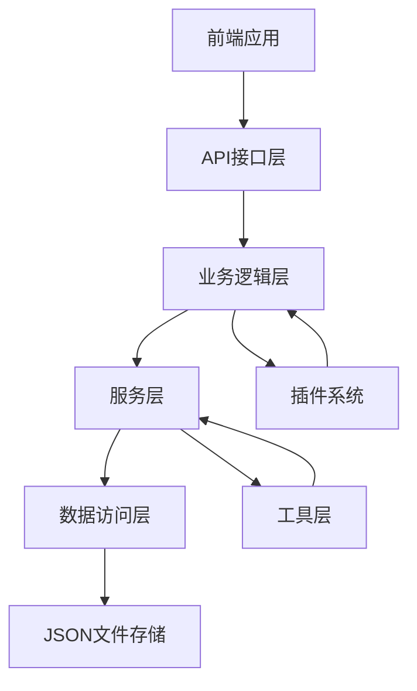

# TimeNest 课程表软件后端引擎全局文档

## 目录

1. [系统概述](#系统概述)
2. [整体架构设计](#整体架构设计)
3. [技术选型](#技术选型)
4. [模块划分](#模块划分)
5. [数据模型](#数据模型)
6. [服务层架构](#服务层架构)
7. [插件系统](#插件系统)
8. [工具模块](#工具模块)
9. [数据管理](#数据管理)
10. [配置管理](#配置管理)
11. [部署指南](#部署指南)
12. [API接口](#api接口)
13. [新增功能模块](#新增功能模块)
14. [最佳实践](#最佳实践)
15. [故障排除](#故障排除)

## 系统概述

TimeNest 是一个面向班级授课大屏共用的课程表软件，旨在提供灵活的课程安排管理功能。后端引擎采用Python实现，提供完整的课程管理、课程表管理、临时换课、循环课程表等功能，并支持插件扩展。

### 核心特性
- **课程管理**：创建、编辑、删除课程信息
- **课程表管理**：灵活的周课程表安排
- **临时换课**：支持临时和永久换课
- **循环课程表**：支持多周循环课程表
- **插件系统**：可扩展的插件架构
- **数据同步**：多设备数据同步
- **冲突检测**：自动检测课程冲突
- **备份恢复**：自动备份和数据恢复
- **新增功能**：天气展示、倒计时、课程简称、任务调度、开机启动、调试模式、时间同步

## 整体架构设计

### 架构模式
TimeNest 采用分层架构模式：

1. **API接口层**：提供RESTful API接口
2. **业务逻辑层**：实现核心业务逻辑
3. **服务层**：提供具体业务功能
4. **数据访问层**：负责数据持久化
5. **工具层**：提供通用工具函数

### 架构图



## 技术选型

### 编程语言
- **Python 3.8+**：主开发语言

### 标准库
- `json`：JSON数据处理
- `os`, `pathlib`：文件系统操作
- `logging`：日志记录
- `datetime`：日期时间处理
- `threading`：多线程支持
- `subprocess`：系统命令执行

### 第三方库
- `requests`：HTTP请求（天气服务）

## 模块划分

### 核心模块结构

```
TimeNest-Dev/
├── core/                    # 核心模块
├── data_access/            # 数据访问层
├── services/               # 服务层
│   ├── course_service.py   # 课程服务
│   ├── schedule_service.py # 课程表服务
│   ├── temp_change_service.py # 临时换课服务
│   ├── cycle_schedule_service.py # 循环课程表服务
│   ├── weather_service.py  # 天气服务
│   ├── countdown_service.py # 倒计时服务
│   ├── course_alias_service.py # 课程简称服务
│   ├── task_scheduler_service.py # 任务调度服务
│   ├── startup_service.py  # 开机启动服务
│   ├── debug_service.py    # 调试服务
│   ├── time_sync_service.py # 时间同步服务
│   └── service_factory.py  # 服务工厂
├── models/                 # 数据模型
├── plugins/               # 插件系统
├── utils/                 # 工具模块
└── docs/                  # 文档目录
```

## 数据模型

### 核心数据模型

#### 课程模型 (ClassItem)
```json
{
  "id": "string",
  "name": "string",
  "teacher": "string",
  "location": "string",
  "duration": {
    "start_time": "HH:MM",
    "end_time": "HH:MM"
  }
}
```

#### 课程表模型 (ClassPlan)
```json
{
  "id": "string",
  "day_of_week": "integer (0-6)",
  "week_parity": "string (odd/even/both)",
  "course_id": "string",
  "valid_from": "date",
  "valid_to": "date"
}
```

#### 临时换课模型 (TempChange)
```json
{
  "id": "string",
  "original_schedule_id": "string",
  "new_course_id": "string",
  "change_date": "date",
  "is_permanent": "boolean",
  "used": "boolean"
}
```

#### 循环课程表模型 (CycleSchedule)
```json
{
  "id": "string",
  "name": "string",
  "cycle_length": "integer",
  "schedules": [
    {
      "week_index": "integer",
      "schedule_items": [
        {
          "day_of_week": "integer",
          "course_id": "string"
        }
      ]
    }
  ]
}
```

### 新增功能数据模型

#### 天气数据模型 (WeatherData)
```json
{
  "location": "string",
  "temperature": "number",
  "humidity": "number",
  "description": "string",
  "last_updated": "datetime"
}
```

#### 倒计时模型 (CountdownItem)
```json
{
  "id": "string",
  "name": "string",
  "target_date": "date",
  "description": "string",
  "color": "string"
}
```

#### 课程简称模型 (CourseAlias)
```json
{
  "id": "string",
  "course_id": "string",
  "alias": "string",
  "description": "string"
}
```

#### 计划任务模型 (ScheduledTask)
```json
{
  "id": "string",
  "name": "string",
  "command": "string",
  "task_type": "string",
  "schedule": "string",
  "enabled": "boolean",
  "last_run": "datetime",
  "next_run": "datetime"
}
```

#### 开机启动项模型 (StartupItem)
```json
{
  "id": "string",
  "name": "string",
  "executable_path": "string",
  "arguments": "string",
  "enabled": "boolean"
}
```

#### 调试配置模型 (DebugSettings)
```json
{
  "enabled": "boolean",
  "log_level": "string",
  "log_to_file": "boolean",
  "log_file_path": "string"
}
```

#### 时间同步配置模型 (TimeSyncSettings)
```json
{
  "enabled": "boolean",
  "sync_interval": "integer",
  "ntp_server": "string",
  "auto_sync": "boolean"
}
```

## 服务层架构

### 服务工厂 (ServiceFactory)
统一的服务创建和管理中心，支持单例模式。

### 核心服务列表

| 服务名称 | 功能描述 |
|----------|----------|
| CourseService | 课程管理 |
| ScheduleService | 课程表管理 |
| TempChangeService | 临时换课管理 |
| CycleScheduleService | 循环课程表管理 |
| UserService | 用户管理 |
| NotificationService | 通知管理 |
| StatisticsService | 统计分析 |
| DataService | 数据导入导出 |
| BackupService | 备份恢复 |
| ConflictDetectionService | 冲突检测 |
| ReminderService | 自动提醒 |
| SyncService | 数据同步 |
| ConfigService | 系统配置 |

### 新增服务列表

| 服务名称 | 功能描述 |
|----------|----------|
| WeatherService | 实时天气数据获取 |
| CountdownService | 倒计时管理 |
| CourseAliasService | 课程简称管理 |
| TaskSchedulerService | 计划任务调度 |
| StartupService | 开机启动项管理 |
| DebugService | 调试模式管理 |
| TimeSyncService | 系统时间同步 |

## 插件系统

### 插件架构
- **插件接口**：定义标准插件接口
- **插件管理器**：负责插件加载、卸载、配置
- **插件类型**：课程插件、时间表插件、UI插件、数据插件

### 插件生命周期
1. **发现**：自动发现plugins目录下的插件
2. **加载**：动态加载插件模块
3. **初始化**：调用插件初始化方法
4. **执行**：执行插件功能
5. **清理**：卸载插件资源

## 工具模块

### 验证工具 (validation_utils.py)
- 课程数据验证
- 课程表数据验证
- 时间冲突检测
- 教师时间冲突检测
- 教室资源冲突检测

### 日期时间工具 (date_utils.py)
- 周奇偶性计算
- 周日期列表获取
- 日期范围检查
- 循环周索引计算

### 日志工具 (logger.py)
- 服务专用日志记录器
- 控制台和文件日志输出
- 异常信息记录

### 异常处理 (exceptions.py)
- 统一异常层次结构
- 详细错误信息记录
- 异常传播机制

## 数据管理

### 数据文件结构
```
data/
├── courses.json              # 课程数据
├── schedules.json            # 课程表数据
├── temp_changes.json         # 临时换课数据
├── cycle_schedules.json      # 循环课程表数据
├── user_settings.json        # 用户设置
├── plugins.json              # 插件配置
├── weather_settings.json     # 天气设置
├── countdown_settings.json   # 倒计时设置
├── course_alias_settings.json # 课程简称设置
├── task_settings.json        # 任务调度设置
├── startup_settings.json     # 开机启动设置
├── debug_settings.json       # 调试设置
├── time_sync_settings.json   # 时间同步设置
└── backups/                  # 数据备份目录
```

### 备份策略
- **自动备份**：定时自动备份
- **手动备份**：支持手动触发备份
- **版本管理**：按时间戳管理备份版本
- **恢复机制**：支持从备份恢复数据

## 配置管理

### 系统配置
- **环境变量**：支持通过环境变量配置
- **配置文件**：JSON格式配置文件
- **动态配置**：支持运行时配置更新
- **配置验证**：自动验证配置有效性

### 配置项说明

| 配置项 | 类型 | 默认值 | 说明 |
|--------|------|--------|------|
| theme | string | "light" | 主题设置 |
| language | string | "zh-CN" | 语言设置 |
| auto_backup | boolean | true | 自动备份开关 |
| backup_interval | integer | 24 | 备份间隔(小时) |
| data_dir | string | "./data" | 数据目录 |

## 部署指南

### 系统要求
- **操作系统**：Windows 10+ / macOS 10.15+ / Linux Ubuntu 20.04+
- **Python版本**：3.8+
- **内存要求**：最低512MB，推荐1GB+
- **存储要求**：最低100MB，推荐1GB+

### 安装步骤

#### 1. 源码安装
```bash
# 克隆源码
git clone [repository-url]
cd TimeNest-Dev

# 创建虚拟环境
python -m venv venv
source venv/bin/activate  # Linux/macOS
# 或
venv\Scripts\activate     # Windows

# 安装依赖
pip install -r requirements.txt
```

#### 2. 启动应用
```bash
# 启动主应用
python main.py

# 启动Web服务
python app.py
```

### 环境配置

#### 环境变量
```bash
# 数据目录
export TIMENEST_DATA_DIR="./data"

# 日志级别
export TIMENEST_LOG_LEVEL="INFO"

# 天气API密钥
export WEATHER_API_KEY="your_api_key"
```

## API接口

### RESTful API设计

#### 课程管理接口
- `GET /api/courses` - 获取所有课程
- `POST /api/courses` - 创建课程
- `PUT /api/courses/{id}` - 更新课程
- `DELETE /api/courses/{id}` - 删除课程

#### 课程表管理接口
- `GET /api/schedules` - 获取课程表
- `POST /api/schedules` - 创建课程表项
- `PUT /api/schedules/{id}` - 更新课程表项
- `DELETE /api/schedules/{id}` - 删除课程表项

#### 新增功能接口

##### 天气服务接口
- `GET /api/weather/settings` - 获取天气设置
- `POST /api/weather/settings` - 更新天气设置
- `GET /api/weather/current` - 获取当前天气

##### 倒计时服务接口
- `GET /api/countdown/settings` - 获取倒计时设置
- `POST /api/countdown/settings` - 更新倒计时设置
- `GET /api/countdown/items` - 获取所有倒计时项目
- `POST /api/countdown/items` - 添加倒计时项目

##### 课程简称服务接口
- `GET /api/course_alias/settings` - 获取课程简称设置
- `POST /api/course_alias/settings` - 更新课程简称设置
- `GET /api/course_alias/items` - 获取所有课程简称
- `POST /api/course_alias/items` - 添加课程简称

##### 任务调度服务接口
- `GET /api/task_scheduler/settings` - 获取任务调度设置
- `POST /api/task_scheduler/settings` - 更新任务调度设置
- `GET /api/task_scheduler/tasks` - 获取所有计划任务
- `POST /api/task_scheduler/tasks` - 添加计划任务
- `POST /api/task_scheduler/tasks/{id}/execute` - 执行任务

##### 开机启动服务接口
- `GET /api/startup/settings` - 获取开机启动设置
- `POST /api/startup/settings` - 更新开机启动设置
- `GET /api/startup/items` - 获取所有开机启动项
- `POST /api/startup/items` - 添加开机启动项

##### 调试服务接口
- `GET /api/debug/settings` - 获取调试设置
- `POST /api/debug/settings` - 更新调试设置
- `POST /api/debug/enable` - 启用调试模式
- `POST /api/debug/disable` - 禁用调试模式

##### 时间同步服务接口
- `GET /api/time_sync/settings` - 获取时间同步设置
- `POST /api/time_sync/settings` - 更新时间同步设置
- `POST /api/time_sync/sync` - 手动同步时间
- `GET /api/time_sync/status` - 获取同步状态

## 新增功能模块

### 1. 实时天气数据展示模块

#### 功能描述
- 获取实时天气数据
- 支持多城市天气查询
- 天气数据缓存机制
- 天气异常处理

#### 技术实现
- 使用OpenWeatherMap API
- 实现数据缓存和更新机制
- 支持跨平台天气数据获取

#### 配置示例
```json
{
  "location": "Beijing",
  "api_key": "your_api_key",
  "update_interval": 3600,
  "cache_duration": 1800
}
```

### 2. 特定日期倒计时计算模块

#### 功能描述
- 创建和管理倒计时项目
- 自动计算剩余时间
- 支持多种倒计时类型
- 可视化倒计时展示

#### 技术实现
- 精确的时间计算算法
- 支持时区处理
- 事件触发机制

#### 使用示例
```python
from services.service_factory import ServiceFactory

countdown_service = ServiceFactory.get_countdown_service()
countdown = countdown_service.create_countdown(
    name="期末考试",
    target_date="2024-06-15",
    description="本学期期末考试"
)
```

### 3. 课程名称简称管理模块

#### 功能描述
- 为课程创建简称
- 自动生成课程简称
- 简称冲突检测
- 简称统一管理

#### 技术实现
- 智能简称生成算法
- 冲突检测机制
- 简称映射管理

#### 使用示例
```python
alias_service = ServiceFactory.get_course_alias_service()
alias = alias_service.create_alias(
    course_id="course_001",
    alias="高数",
    description="高等数学简称"
)
```

### 4. 计划任务执行模块

#### 功能描述
- 创建和管理计划任务
- 支持跨平台任务执行
- 任务状态监控
- 任务日志记录

#### 技术实现
- 跨平台命令适配
- 任务调度算法
- 状态监控机制
- 错误处理和重试

#### 支持的平台
- Windows：使用任务计划程序
- macOS：使用launchd
- Linux：使用cron/systemd

### 5. 开机启动项配置模块

#### 功能描述
- 管理开机启动程序
- 跨平台启动项配置
- 启动项状态管理
- 启动日志记录

#### 技术实现
- Windows注册表操作
- macOS plist文件管理
- Linux .desktop文件管理

#### 配置示例
```json
{
  "name": "TimeNest启动器",
  "executable_path": "/usr/local/bin/timenest",
  "arguments": "--auto-start",
  "enabled": true
}
```

### 6. 系统调试模式模块

#### 功能描述
- 启用/禁用调试模式
- 动态日志级别调整
- 调试信息收集
- 性能监控

#### 技术实现
- 动态日志配置
- 调试信息缓存
- 性能指标收集
- 错误追踪机制

### 7. 系统时间自动同步模块

#### 功能描述
- 自动同步系统时间
- 支持NTP服务器配置
- 同步状态监控
- 同步失败处理

#### 技术实现
- NTP协议支持
- 多NTP服务器配置
- 同步频率控制
- 网络异常处理

#### 配置示例
```json
{
  "enabled": true,
  "sync_interval": 3600,
  "ntp_server": "ntp.aliyun.com",
  "auto_sync": true
}
```

## 最佳实践

### 1. 代码规范
- 遵循PEP 8 Python编码规范
- 使用类型注解提高代码可读性
- 编写单元测试确保代码质量
- 使用有意义的变量和函数命名

### 2. 错误处理
- 使用统一的异常层次结构
- 提供详细的错误信息
- 实现适当的错误恢复机制
- 记录完整的错误日志

### 3. 性能优化
- 实现数据缓存机制
- 使用异步处理提高响应速度
- 优化数据库查询性能
- 实现资源池管理

### 4. 安全配置
- 敏感信息加密存储
- 实现访问权限控制
- 定期更新依赖库
- 使用安全的通信协议

## 故障排除

### 常见问题及解决方案

#### 1. 启动失败
**症状**：应用无法启动
**可能原因**：
- Python版本不兼容
- 缺少依赖库
- 配置文件格式错误

**解决方案**：
```bash
# 检查Python版本
python --version

# 安装依赖
pip install -r requirements.txt

# 验证配置文件
python -m json.tool data/user_settings.json
```

#### 2. 数据访问错误
**症状**：无法读取或写入数据
**可能原因**：
- 文件权限问题
- 磁盘空间不足
- 数据文件损坏

**解决方案**：
```bash
# 检查文件权限
ls -la data/

# 检查磁盘空间
df -h

# 从备份恢复
cp data/backups/*.backup_* data/
```

#### 3. 服务调用失败
**症状**：服务方法调用异常
**可能原因**：
- 参数验证失败
- 数据冲突
- 网络连接问题

**解决方案**：
```python
# 查看详细错误信息
try:
    result = service.method(params)
except Exception as e:
    print(f"错误详情: {str(e)}")
    # 查看日志文件
```

### 日志分析

#### 日志文件位置
```
logs/
├── course_service.log
├── schedule_service.log
├── weather_service.log
├── countdown_service.log
├── task_scheduler_service.log
├── startup_service.log
├── debug_service.log
├── time_sync_service.log
└── system.log
```

#### 日志级别
- **DEBUG**：调试信息
- **INFO**：一般信息
- **WARNING**：警告信息
- **ERROR**：错误信息
- **CRITICAL**：严重错误

### 性能监控

#### 关键指标
- **响应时间**：API调用响应时间
- **内存使用**：内存占用情况
- **CPU使用率**：CPU资源消耗
- **磁盘I/O**：文件读写性能

#### 监控工具
- 使用内置的性能监控
- 集成第三方监控工具
- 定期生成性能报告

### 联系支持

如遇到无法解决的问题，可以通过以下方式获取支持：

1. **查看日志文件**：检查logs目录下的详细日志
2. **查阅文档**：参考本文档的相关章节
3. **社区支持**：访问项目社区获取帮助
4. **提交Issue**：在GitHub提交详细的错误报告

---

**文档版本**：v3.0  
**最后更新**：2024年  
**维护团队**：TimeNest开发团队