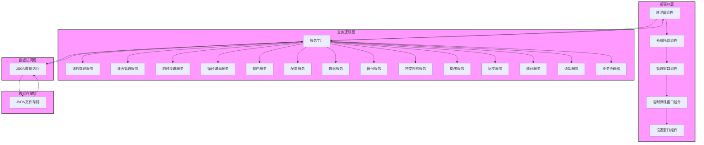
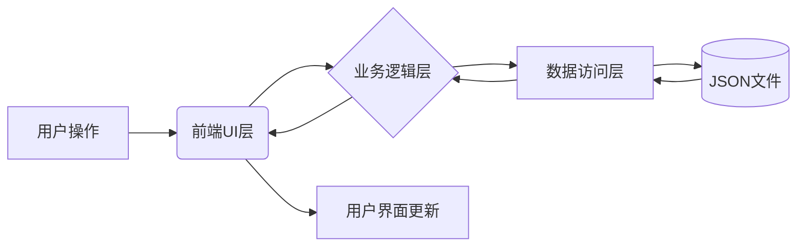
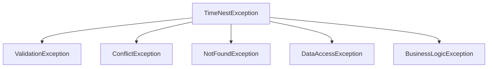

# TimeNest 智能课程表软件架构设计方案

## 1. 概述

TimeNest 是一个智能课程表桌面应用，采用分层架构设计，包括前端UI层、业务逻辑层、数据访问层和数据存储层。应用提供课程管理、课表安排、临时调课等功能，采用悬浮窗设计，支持Windows/Linux双平台，使用JSON文件存储数据。

## 2. 分层架构图



## 3. 各层职责和功能

### 3.1 前端UI层

前端UI层负责用户界面的展示和用户交互处理，包括以下组件：

1. **悬浮窗组件**：提供简约现代的悬浮窗，显示时间、课程状态等信息，支持自动隐藏、鼠标穿透和拖动定位。
2. **系统托盘组件**：提供应用控制菜单，支持课表管理、临时调课、设置等功能。
3. **管理窗口组件**：提供可视化课程和课程表管理界面，支持课程和课表的增删改查。
4. **临时调课窗口组件**：提供快速设置单节课程临时更换的功能。
5. **设置窗口组件**：提供应用配置管理界面。

### 3.2 业务逻辑层

业务逻辑层实现核心业务逻辑，处理课程管理、课表安排、临时调课等功能，包括以下服务：

1. **服务工厂**：统一管理所有服务的创建和访问，实现单例模式。
2. **课程管理服务**：提供课程的增删改查功能，包括数据验证和冲突检测。
3. **课表管理服务**：管理课程表项的增删改查，支持周次和日期范围管理。
4. **临时换课服务**：处理临时课程调整，支持临时和永久换课。
5. **循环课表服务**：支持多周轮回课程表的生成和管理。
6. **用户服务**：管理用户设置和配置。
7. **配置服务**：处理应用配置的读取和保存。
8. **数据服务**：提供数据导入导出功能。
9. **备份服务**：实现数据备份和恢复功能。
10. **冲突检测服务**：检测课程时间、教师和教室资源冲突。
11. **提醒服务**：提供课程提醒功能。
12. **同步服务**：支持多设备数据同步。
13. **统计服务**：提供课程和时间统计分析功能。
14. **通知服务**：处理系统通知和消息。
15. **业务协调器**：协调多个服务之间的复杂业务逻辑。

### 3.3 数据访问层

数据访问层负责与JSON文件存储进行交互，提供数据的持久化和检索功能：

1. **JSON数据访问**：提供JSON文件的读写、序列化/反序列化功能，支持缓存机制和数据验证。

### 3.4 数据存储层

数据存储层负责实际的数据存储：

1. **JSON文件存储**：以JSON格式存储课程、课表、临时换课等数据，支持备份和恢复。

## 4. 模块接口规范

### 4.1 前端UI层接口

前端UI层通过API客户端与后端服务进行通信：

```python
class APIClient:
    def get_courses(self) -> List[Dict]: ...
    def save_courses(self, courses: List[Dict]) -> bool: ...
    def get_schedules(self) -> List[Dict]: ...
    def save_schedules(self, schedules: List[Dict]) -> bool: ...
    def get_temp_changes(self) -> List[Dict]: ...
    def save_temp_changes(self, temp_changes: List[Dict]) -> bool: ...
    def get_settings(self) -> Dict: ...
    def save_settings(self, settings: Dict) -> bool: ...
    def get_today_schedule(self) -> Dict: ...
```

### 4.2 业务逻辑层接口

业务逻辑层通过服务工厂提供统一的服务访问接口：

```python
class ServiceFactory:
    @classmethod
    def get_course_service(cls) -> CourseService: ...
    @classmethod
    def get_schedule_service(cls) -> ScheduleService: ...
    @classmethod
    def get_temp_change_service(cls) -> TempChangeService: ...
    # ... 其他服务获取方法
```

各服务提供具体的业务接口，例如课程服务：

```python
class CourseService:
    def create_course(self, course: ClassItem) -> ClassItem: ...
    def update_course(self, course_id: str, updated_course: ClassItem) -> ClassItem: ...
    def delete_course(self, course_id: str) -> bool: ...
    def get_course_by_id(self, course_id: str) -> Optional[ClassItem]: ...
    def get_all_courses(self) -> List[ClassItem]: ...
```

### 4.3 数据访问层接口

数据访问层提供统一的数据访问接口：

```python
class JSONDataAccess:
    def read_json(self, filename: str) -> Optional[Dict[str, Any]]: ...
    def write_json(self, filename: str, data: Dict[str, Any]) -> bool: ...
    def validate_data(self, data: Dict[str, Any], schema: Dict[str, Any]) -> bool: ...
    def backup_data(self, filename: str) -> bool: ...
    def restore_data(self, filename: str, backup_filename: str) -> bool: ...
```

## 5. 数据流和控制流设计方案

### 5.1 数据流设计



### 5.2 控制流设计

1. 用户在前端UI层进行操作（如添加课程）
2. 前端UI层通过API客户端向业务逻辑层发送请求
3. 业务逻辑层接收请求，进行数据验证和业务逻辑处理
4. 业务逻辑层调用数据访问层进行数据持久化
5. 数据访问层操作JSON文件存储
6. 数据访问层返回操作结果给业务逻辑层
7. 业务逻辑层处理结果并返回给前端UI层
8. 前端UI层更新界面显示

## 6. 关键设计模式应用方案

### 6.1 工厂模式

服务工厂（ServiceFactory）使用工厂模式统一管理所有服务的创建和访问，隐藏具体服务类的实例化过程。

### 6.2 单例模式

服务工厂中的服务实例采用单例模式，确保每个服务只有一个实例，节省系统资源。

### 6.3 数据访问对象模式（DAO）

JSON数据访问（JSONDataAccess）使用数据访问对象模式，封装对JSON文件的访问操作，提供统一的数据访问接口。

### 6.4 模型-视图-控制器模式（MVC）

前端UI层采用MVC模式：
- 模型：通过API客户端获取的数据
- 视图：各种UI组件（悬浮窗、管理窗口等）
- 控制器：各UI组件中的事件处理逻辑

### 6.5 观察者模式

在数据更新时，使用观察者模式通知相关组件更新界面显示。

## 7. 错误处理和异常管理策略

### 7.1 异常层次结构



### 7.2 错误处理策略

1. **数据验证异常**：在数据输入时进行验证，发现错误时抛出ValidationException
2. **资源冲突异常**：在检测到资源冲突时抛出ConflictException
3. **资源未找到异常**：在查找资源未找到时抛出NotFoundException
4. **数据访问异常**：在数据访问出错时抛出DataAccessException
5. **业务逻辑异常**：在业务逻辑处理出错时抛出BusinessLogicException

### 7.3 异常处理流程

1. 在各层中捕获和处理可能的异常
2. 对于可恢复的错误，提供重试机制
3. 对于不可恢复的错误，记录详细信息并安全退出
4. 向用户显示友好的错误信息

## 8. 配置管理和扩展性方案

### 8.1 配置管理

1. **用户设置**：通过UserSettings模型管理用户配置
2. **系统配置**：通过config.py管理全局配置
3. **动态配置**：支持运行时配置更新

### 8.2 扩展性方案

1. **插件系统**：预留插件接口，支持功能扩展
2. **服务扩展**：通过服务工厂支持新服务的添加
3. **数据模型扩展**：通过继承和组合支持数据模型扩展
4. **UI组件扩展**：通过模块化设计支持UI组件扩展

## 9. 总结

本架构设计方案为TimeNest智能课程表软件提供了一个清晰、可扩展的分层架构。通过合理的层次划分和模块设计，系统具有良好的可维护性和可扩展性。关键设计模式的应用提高了代码的复用性和可读性，完善的错误处理机制确保了系统的稳定性和可靠性。