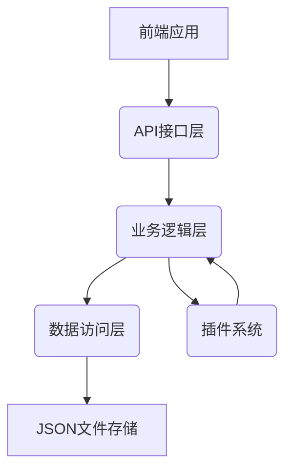

# TimeNest 课程表软件后端技术文档

## 目录

1. [概述](#概述)
2. [技术架构](#技术架构)
   - [整体架构设计](#整体架构设计)
   - [技术选型](#技术选型)
   - [架构图](#架构图)
   - [模块划分](#模块划分)
3. [数据模型](#数据模型)
   - [课程模型 (ClassItem)](#课程模型-classitem)
   - [课程表模型 (ClassPlan)](#课程表模型-classplan)
   - [临时换课模型 (TempChange)](#临时换课模型-tempchange)
   - [循环课程表模型 (CycleSchedule)](#循环课程表模型-cycleschedule)
   - [用户设置模型 (UserSettings)](#用户设置模型-usersettings)
   - [插件配置模型 (PluginConfig)](#插件配置模型-pluginconfig)
4. [API 接口](#api-接口)
   - [课程管理接口](#课程管理接口)
   - [课程表管理接口](#课程表管理接口)
   - [临时换课接口](#临时换课接口)
   - [循环课程表接口](#循环课程表接口)
   - [插件管理接口](#插件管理接口)
5. [业务逻辑层](#业务逻辑层)
   - [课程管理服务 (CourseService)](#课程管理服务-courseservice)
   - [课程表管理服务 (ScheduleService)](#课程表管理服务-scheduleservice)
   - [临时换课服务 (TempChangeService)](#临时换课服务-tempchangeservice)
   - [循环课程表服务 (CycleScheduleService)](#循环课程表服务-cyclescheduleservice)
   - [业务协调器 (BusinessCoordinator)](#业务协调器-businesscoordinator)
6. [插件系统](#插件系统)
   - [插件架构](#插件架构)
   - [插件接口](#插件接口)
   - [插件管理器](#插件管理器)
   - [插件开发指南](#插件开发指南)
7. [部署与配置](#部署与配置)
   - [系统要求](#系统要求)
   - [安装步骤](#安装步骤)
   - [环境配置](#环境配置)
   - [启动和停止应用](#启动和停止应用)
   - [故障排除](#故障排除)
8. [性能优化和最佳实践](#性能优化和最佳实践)
   - [性能优化建议](#性能优化建议)
   - [最佳实践](#最佳实践)
   - [故障排除指南](#故障排除指南)

## 概述

TimeNest 是一个面向班级授课大屏共用的课程表软件，旨在提供灵活的课程安排管理功能。本文档详细描述了 TimeNest 的后端技术实现，包括整体架构、数据模型、API 接口、业务逻辑层、插件系统、部署配置以及性能优化等方面的内容。

## 技术架构

### 整体架构设计

TimeNest 采用分层架构模式，将系统划分为以下三个主要层次：

1. **数据访问层 (Data Access Layer)**: 负责与 JSON 文件存储进行交互，提供数据的持久化和检索功能。
2. **业务逻辑层 (Business Logic Layer)**: 实现核心业务逻辑，处理课程编辑、课程表管理、多周轮回课程表、临时换课等功能。
3. **API 接口层 (API Interface Layer)**: 提供统一的接口供前端调用，处理请求和响应。

### 技术选型

- **编程语言**: Python 3.8+
- **数据存储**: JSON 文件存储
- **依赖管理**: pip
- **其他库**: 
  - `json` (Python 标准库) - JSON 数据处理
  - `os`, `pathlib` (Python 标准库) - 文件系统操作
  - `logging` (Python 标准库) - 日志记录
  - `datetime` (Python 标准库) - 日期时间处理
  - `flask` (第三方库) - Web 框架，用于提供 HTTP API 接口

### 架构图



### 模块划分

#### 核心模块 (core/)

- `application.py`: 应用程序入口和主协调器
- `config.py`: 配置管理

#### 数据访问模块 (data_access/)

- `json_data_access.py`: JSON 数据访问实现

#### 业务逻辑模块 (services/)

- `course_service.py`: 课程管理服务
- `schedule_service.py`: 课程表管理服务
- `temp_change_service.py`: 临时换课服务
- `cycle_schedule_service.py`: 多周轮回课程表服务
- `business_coordinator.py`: 业务逻辑层主协调器
- `service_factory.py`: 服务工厂类

#### 模型模块 (models/)

- `class_item.py`: 课程模型
- `class_plan.py`: 课程表模型
- `temp_change.py`: 临时换课模型
- `cycle_schedule.py`: 循环课程表模型
- `user_settings.py`: 用户设置模型
- `plugin_config.py`: 插件配置模型

#### 插件管理模块 (plugins/)

- `plugin_manager.py`: 插件管理器
- `plugin_interface.py`: 插件接口定义
- `course_plugin_interface.py`: 课程插件接口
- `schedule_plugin_interface.py`: 时间表插件接口
- `ui_plugin_interface.py`: UI 插件接口
- `data_plugin_interface.py`: 数据插件接口

#### 工具模块 (utils/)

- `date_utils.py`: 日期时间工具
- `validation_utils.py`: 数据验证工具
- `logger.py`: 日志工具
- `exceptions.py`: 自定义异常类

## 数据模型

### 课程模型 (ClassItem)

课程模型表示一个具体的课程，包含课程的基本信息和时间安排。

```python
@dataclass
class TimeSlot:
    """时间段模型"""
    start_time: str  # 格式: HH:MM
    end_time: str    # 格式: HH:MM

@dataclass
class ClassItem:
    """课程模型类"""
    id: str
    name: str
    teacher: str
    location: str
    duration: TimeSlot
```

字段说明：
- `id`: 课程唯一标识符
- `name`: 课程名称
- `teacher`: 授课教师
- `location`: 上课地点
- `duration`: 上课时间，包含开始时间和结束时间

### 课程表模型 (ClassPlan)

课程表模型表示课程在一周中的安排，包括星期几、周奇偶性等信息。

```python
@dataclass
class ClassPlan:
    """课程表模型类"""
    id: str
    day_of_week: int  # 0-6, 0表示星期日
    week_parity: str  # "odd"表示奇数周, "even"表示偶数周, "both"表示每周
    course_id: str
    valid_from: str  # 日期格式: YYYY-MM-DD
    valid_to: str    # 日期格式: YYYY-MM-DD
```

字段说明：
- `id`: 课程表项唯一标识符
- `day_of_week`: 星期几 (0-6, 0表示星期日)
- `week_parity`: 周奇偶性 ("odd"表示奇数周, "even"表示偶数周, "both"表示每周)
- `course_id`: 关联的课程ID
- `valid_from`: 有效开始日期 (格式: YYYY-MM-DD)
- `valid_to`: 有效结束日期 (格式: YYYY-MM-DD)

### 临时换课模型 (TempChange)

临时换课模型表示一次临时的课程调整，可以是某一天的换课安排。

```python
@dataclass
class TempChange:
    """临时换课模型类"""
    id: str
    original_schedule_id: str
    new_course_id: str
    change_date: str  # 日期格式: YYYY-MM-DD
    is_permanent: bool = False
    used: bool = False
```

字段说明：
- `id`: 临时换课唯一标识符
- `original_schedule_id`: 原课程表项ID
- `new_course_id`: 新课程ID
- `change_date`: 换课日期 (格式: YYYY-MM-DD)
- `is_permanent`: 是否为永久换课
- `used`: 是否已使用

### 循环课程表模型 (CycleSchedule)

循环课程表模型表示一个多周循环的课程安排，适用于需要按周期重复的课程表。

```python
@dataclass
class ScheduleItem:
    """课程表项"""
    day_of_week: int  # 0-6, 0表示星期日
    course_id: str

@dataclass
class CycleScheduleItem:
    """循环课程表项"""
    week_index: int
    schedule_items: List[ScheduleItem]

@dataclass
class CycleSchedule:
    """循环课程表模型类"""
    id: str
    name: str
    cycle_length: int
    schedules: List[CycleScheduleItem]
```

字段说明：
- `id`: 循环课程表唯一标识符
- `name`: 循环课程表名称
- `cycle_length`: 循环长度
- `schedules`: 循环课程表项列表
  - `week_index`: 周索引
  - `schedule_items`: 课程表项列表
    - `day_of_week`: 星期几 (0-6, 0表示星期日)
    - `course_id`: 课程ID

### 用户设置模型 (UserSettings)

用户设置模型存储用户的个性化配置。

```python
@dataclass
class UserSettings:
    """用户设置模型类"""
    theme: str = "light"  # 主题设置: light, dark
    language: str = "zh-CN"  # 语言设置
    auto_backup: bool = True  # 是否自动备份
    backup_interval: int = 24  # 自动备份间隔（小时）
    data_dir: str = "./data"  # 数据存储目录
```

### 插件配置模型 (PluginConfig)

插件配置模型存储插件的配置信息。

```python
@dataclass
class PluginConfig:
    """插件配置模型类"""
    id: str
    name: str
    version: str
    enabled: bool = True
    config: Optional[Dict[str, Any]] = None
    dependencies: Optional[List[str]] = None
    metadata: Optional[Dict[str, Any]] = None
```

## API 接口

### 课程管理接口

- `POST /courses` - 创建课程
- `GET /courses` - 获取所有课程
- `GET /courses/{id}` - 获取指定课程
- `PUT /courses/{id}` - 更新课程
- `DELETE /courses/{id}` - 删除课程

### 课程表管理接口

- `POST /schedules` - 创建课程表项
- `GET /schedules` - 获取所有课程表项
- `GET /schedules/{id}` - 获取指定课程表项
- `PUT /schedules/{id}` - 更新课程表项
- `DELETE /schedules/{id}` - 删除课程表项

### 临时换课接口

- `POST /temp_changes` - 创建临时换课
- `GET /temp_changes` - 获取所有临时换课
- `GET /temp_changes/{id}` - 获取指定临时换课
- `PUT /temp_changes/{id}` - 更新临时换课
- `DELETE /temp_changes/{id}` - 删除临时换课

### 循环课程表接口

- `POST /cycle_schedules` - 创建循环课程表
- `GET /cycle_schedules` - 获取所有循环课程表
- `GET /cycle_schedules/{id}` - 获取指定循环课程表
- `PUT /cycle_schedules/{id}` - 更新循环课程表
- `DELETE /cycle_schedules/{id}` - 删除循环课程表

### 插件管理接口

- `POST /plugins/load` - 加载插件
- `POST /plugins/unload` - 卸载插件
- `GET /plugins` - 获取插件列表
- `POST /plugins/{plugin_id}/execute` - 执行插件功能

## 业务逻辑层

### 课程管理服务 (CourseService)

课程管理服务负责处理课程相关的业务逻辑，包括创建、更新、删除和查询课程等功能。

主要功能：
- 创建课程 (`create_course`)
- 更新课程 (`update_course`)
- 删除课程 (`delete_course`)
- 根据ID获取课程 (`get_course_by_id`)
- 获取所有课程 (`get_all_courses`)
- 检查课程冲突 (`_check_course_conflicts`)

### 课程表管理服务 (ScheduleService)

课程表管理服务负责处理课程表相关的业务逻辑，包括创建、更新、删除和查询课程表等功能。

主要功能：
- 创建课程表项 (`create_schedule`)
- 更新课程表项 (`update_schedule`)
- 删除课程表项 (`delete_schedule`)
- 根据ID获取课程表项 (`get_schedule_by_id`)
- 获取所有课程表项 (`get_all_schedules`)
- 根据日期获取课程表项 (`get_schedules_by_date`)
- 根据课程ID获取课程表项 (`get_schedules_by_course`)

### 临时换课服务 (TempChangeService)

临时换课服务负责处理临时换课相关的业务逻辑，包括创建、更新、删除和查询临时换课等功能。

主要功能：
- 创建临时换课 (`create_temp_change`)
- 更新临时换课 (`update_temp_change`)
- 删除临时换课 (`delete_temp_change`)
- 根据ID获取临时换课 (`get_temp_change_by_id`)
- 获取所有临时换课 (`get_all_temp_changes`)
- 根据日期获取临时换课 (`get_temp_changes_by_date`)
- 根据原课程表ID获取临时换课 (`get_temp_changes_by_schedule`)
- 标记临时换课为已使用 (`mark_temp_change_as_used`)

### 循环课程表服务 (CycleScheduleService)

循环课程表服务负责处理循环课程表相关的业务逻辑，包括创建、更新、删除和查询循环课程表等功能。

主要功能：
- 创建循环课程表 (`create_cycle_schedule`)
- 更新循环课程表 (`update_cycle_schedule`)
- 删除循环课程表 (`delete_cycle_schedule`)
- 根据ID获取循环课程表 (`get_cycle_schedule_by_id`)
- 获取所有循环课程表 (`get_all_cycle_schedules`)
- 为指定日期生成课程表项 (`generate_schedule_for_date`)

### 业务协调器 (BusinessCoordinator)

业务协调器负责协调各个服务之间的交互，处理复杂的业务逻辑。

主要功能：
- 创建课程并关联课程表项 (`create_course_with_schedule`)
- 应用临时换课 (`apply_temp_change`)
- 生成循环课程表 (`generate_cycle_schedule`)
- 获取指定日期的周课程表 (`get_weekly_schedule`)

## 插件系统

### 插件架构

TimeNest 的插件系统采用接口化设计，支持多种类型的插件，包括课程插件、时间表插件、UI 插件和数据插件等。

### 插件接口

#### 基础插件接口 (PluginInterface)

所有插件都必须实现基础插件接口：

```python
class PluginInterface(ABC):
    def __init__(self, plugin_id: str, name: str, version: str):
        self.plugin_id = plugin_id
        self.name = name
        self.version = version
        self.enabled = False
    
    @abstractmethod
    def initialize(self, app_context: Any) -> bool:
        """初始化插件"""
        pass
    
    @abstractmethod
    def execute(self, params: Dict[str, Any]) -> Any:
        """执行插件功能"""
        pass
    
    @abstractmethod
    def cleanup(self) -> bool:
        """清理插件资源"""
        pass
```

#### 课程插件接口 (CoursePluginInterface)

用于处理课程相关功能的插件：

```python
class CoursePluginInterface(PluginInterface, ABC):
    @abstractmethod
    def add_course(self, course: ClassItem) -> bool:
        """添加课程"""
        pass
    
    @abstractmethod
    def remove_course(self, course_id: str) -> bool:
        """删除课程"""
        pass
    
    @abstractmethod
    def update_course(self, course_id: str, course: ClassItem) -> bool:
        """更新课程"""
        pass
    
    @abstractmethod
    def get_course(self, course_id: str) -> Optional[ClassItem]:
        """获取课程"""
        pass
    
    @abstractmethod
    def list_courses(self) -> List[ClassItem]:
        """列出所有课程"""
        pass
```

#### 时间表插件接口 (SchedulePluginInterface)

用于处理时间表相关功能的插件：

```python
class SchedulePluginInterface(PluginInterface, ABC):
    @abstractmethod
    def add_schedule(self, schedule: ClassPlan) -> bool:
        """添加时间表项"""
        pass
    
    @abstractmethod
    def remove_schedule(self, schedule_id: str) -> bool:
        """删除时间表项"""
        pass
    
    @abstractmethod
    def update_schedule(self, schedule_id: str, schedule: ClassPlan) -> bool:
        """更新时间表项"""
        pass
    
    @abstractmethod
    def get_schedule(self, schedule_id: str) -> Optional[ClassPlan]:
        """获取时间表项"""
        pass
    
    @abstractmethod
    def list_schedules(self) -> List[ClassPlan]:
        """列出所有时间表项"""
        pass
```

#### UI 插件接口 (UIPluginInterface)

用于处理用户界面相关功能的插件：

```python
class UIPluginInterface(PluginInterface, ABC):
    @abstractmethod
    def render_widget(self, widget_id: str, params: Optional[Dict[str, Any]] = None) -> str:
        """渲染UI组件"""
        pass
    
    @abstractmethod
    def handle_ui_event(self, event_type: str, data: Dict[str, Any]) -> bool:
        """处理UI事件"""
        pass
    
    @abstractmethod
    def get_ui_config(self) -> Dict[str, Any]:
        """获取UI配置"""
        pass
```

#### 数据插件接口 (DataPluginInterface)

用于处理数据相关功能的插件：

```python
class DataPluginInterface(PluginInterface, ABC):
    @abstractmethod
    def process_data(self, data: Any, processor_config: Optional[Dict[str, Any]] = None) -> Any:
        """处理数据"""
        pass
    
    @abstractmethod
    def validate_data(self, data: Any, validation_rules: Optional[Dict[str, Any]] = None) -> bool:
        """验证数据"""
        pass
    
    @abstractmethod
    def transform_data(self, data: Any, transformation_rules: Dict[str, Any]) -> Any:
        """转换数据"""
        pass
    
    @abstractmethod
    def export_data(self, data: Any, export_format: str, export_config: Optional[Dict[str, Any]] = None) -> bool:
        """导出数据"""
        pass
    
    @abstractmethod
    def import_data(self, source: str, import_config: Optional[Dict[str, Any]] = None) -> Any:
        """导入数据"""
        pass
```

### 插件管理器

插件管理器负责插件的加载、初始化、执行和卸载等功能。

主要功能：
- 发现插件 (`discover_plugins`)
- 加载插件 (`load_plugin`)
- 卸载插件 (`unload_plugin`)
- 重新加载插件 (`reload_plugin`)
- 获取插件 (`get_plugin`)
- 列出所有插件 (`list_plugins`)
- 执行插件 (`execute_plugin`)
- 加载所有插件 (`load_all_plugins`)
- 卸载所有插件 (`unload_all_plugins`)

### 插件开发指南

#### 插件基本结构

一个完整的 TimeNest 插件应包含以下文件：
```
plugins/
└── plugin_name/
    ├── plugin_name.py          # 插件主文件
    └── __init__.py             # Python 包初始化文件
```

#### 插件开发示例

以下是一个简单的课程提醒插件示例：

```python
from plugins.course_plugin_interface import CoursePluginInterface
from models.class_item import ClassItem

class CourseReminderPlugin(CoursePluginInterface):
    def __init__(self):
        super().__init__("course_reminder", "课程提醒插件", "1.0.0")
        self.courses = {}
    
    def initialize(self, app_context) -> bool:
        # 初始化插件
        return True
    
    def execute(self, params: Dict[str, Any]) -> Any:
        # 执行插件功能
        action = params.get("action", "")
        if action == "remind":
            course_id = params.get("course_id")
            return self.remind_course(course_id)
        return {"success": False, "message": "未知操作"}
    
    def cleanup(self) -> bool:
        # 清理插件资源
        return True
    
    def add_course(self, course: ClassItem) -> bool:
        self.courses[course.id] = course
        return True
    
    def remove_course(self, course_id: str) -> bool:
        if course_id in self.courses:
            del self.courses[course_id]
            return True
        return False
    
    def update_course(self, course_id: str, course: ClassItem) -> bool:
        self.courses[course_id] = course
        return True
    
    def get_course(self, course_id: str) -> Optional[ClassItem]:
        return self.courses.get(course_id)
    
    def list_courses(self) -> List[ClassItem]:
        return list(self.courses.values())
    
    def remind_course(self, course_id: str) -> Dict[str, Any]:
        course = self.get_course(course_id)
        if course:
            # 实现提醒逻辑
            return {"success": True, "message": f"已提醒课程: {course.name}"}
        return {"success": False, "message": "课程不存在"}
```

## 部署与配置

### 系统要求

#### 操作系统要求
TimeNest 可以在以下操作系统上运行：
- Windows 10 或更高版本
- macOS 10.15 (Catalina) 或更高版本
- Linux (Ubuntu 20.04 LTS 或更高版本，CentOS 8 或更高版本)

#### Python 版本要求
- Python 3.8 或更高版本

#### 依赖库
TimeNest 使用以下 Python 标准库和第三方库：
- `json` (Python 标准库) - JSON 数据处理
- `os`, `pathlib` (Python 标准库) - 文件系统操作
- `logging` (Python 标准库) - 日志记录
- `datetime` (Python 标准库) - 日期时间处理
- `shutil` (Python 标准库) - 高级文件操作
- `re` (Python 标准库) - 正则表达式处理

### 安装步骤

#### 从源码安装

1. 克隆或下载 TimeNest 源码到本地目录
2. 确保系统已安装 Python 3.8 或更高版本
3. 进入项目根目录
4. 创建虚拟环境（可选但推荐）：
   ```bash
   python -m venv venv
   source venv/bin/activate  # Linux/macOS
   # 或
   venv\Scripts\activate  # Windows
   ```
5. 安装依赖（如果项目有 requirements.txt 文件）：
   ```bash
   pip install -r requirements.txt
   ```

#### 从包安装

目前 TimeNest 不提供预编译的安装包，建议直接从源码安装。

### 环境配置

#### 环境变量
TimeNest 支持以下环境变量配置：
- `TIMENEST_DATA_DIR`：数据存储目录，默认为 `./data`
- `TIMENEST_LOG_LEVEL`：日志级别，默认为 `INFO`

#### 配置文件
TimeNest 使用 JSON 文件作为配置文件，配置文件位于 `data/` 目录下：
- `user_settings.json`：用户设置配置
- `class_plans.json`：课程表数据
- `plugins.json`：插件配置

### 启动和停止应用

#### 启动应用
在项目根目录下执行以下命令启动应用：
```bash
python main.py
```

如果是 Web 应用，可能需要启动 Flask 服务器：
```bash
python app.py
```

#### 停止应用
- 在终端中按 `Ctrl+C` 停止应用
- 如果应用在后台运行，可以使用 `kill` 命令停止进程

### 故障排除

#### 常见问题及解决方案

##### 问题1：Python 版本不兼容
**错误信息**：`SyntaxError` 或 `ImportError`
**解决方案**：确保使用 Python 3.8 或更高版本运行应用。

##### 问题2：缺少依赖库
**错误信息**：`ModuleNotFoundError`
**解决方案**：安装缺失的依赖库：
```bash
pip install -r requirements.txt
```

##### 问题3：数据目录权限问题
**错误信息**：`PermissionError`
**解决方案**：确保应用有权限读写数据目录，可以修改 `data/` 目录的权限或更改 `TIMENEST_DATA_DIR` 环境变量指向有权限的目录。

##### 问题4：JSON 文件格式错误
**错误信息**：`json.JSONDecodeError`
**解决方案**：检查对应的 JSON 配置文件格式是否正确，确保使用有效的 JSON 格式。

#### 日志查看
TimeNest 会将日志记录到 `logs/` 目录下，可以通过查看日志文件来诊断问题：
- `logs/course_service.log`：课程服务日志
- `logs/schedule_service.log`：课程表服务日志
- `logs/temp_change_service.log`：临时换课服务日志
- `logs/cycle_schedule_service.log`：循环课程表服务日志
- `logs/business_coordinator.log`：业务协调器日志
- `logs/PluginManager.log`：插件管理器日志

#### 数据备份和恢复
如果遇到数据损坏问题，可以从备份文件恢复：
1. 查找备份文件：在 `data/backups/` 目录下查找最新的备份文件
2. 将备份文件复制到 `data/` 目录下替换原文件

## 性能优化和最佳实践

### 性能优化建议

1. **数据缓存**：对于频繁访问的数据，可以考虑使用内存缓存来提高访问速度。
2. **批量操作**：对于大量数据的操作，尽量使用批量处理而不是逐条处理。
3. **索引优化**：在数据访问层中，为常用的查询字段建立索引以提高查询效率。
4. **异步处理**：对于耗时的操作，可以考虑使用异步处理来避免阻塞主线程。
5. **资源管理**：及时释放不再使用的资源，如文件句柄、数据库连接等。

### 最佳实践

1. **错误处理**：统一的异常处理机制，确保所有异常都能被正确捕获和处理。
2. **日志记录**：详细的日志记录，包括操作日志、错误日志和调试日志等。
3. **数据验证**：在数据进入系统之前进行严格的验证，确保数据的完整性和正确性。
4. **代码复用**：合理使用继承和接口，提高代码的复用性和可维护性。
5. **文档完善**：保持文档与代码同步更新，确保文档的准确性和完整性。

### 故障排除指南

1. **检查日志**：首先查看相关服务的日志文件，定位问题的具体原因。
2. **验证配置**：检查配置文件是否正确，环境变量是否设置正确。
3. **测试连接**：验证数据库连接、网络连接等是否正常。
4. **回滚操作**：如果问题是由于最近的更改引起的，可以考虑回滚到之前的版本。
5. **联系支持**：如果问题无法解决，可以联系技术支持团队获取帮助。