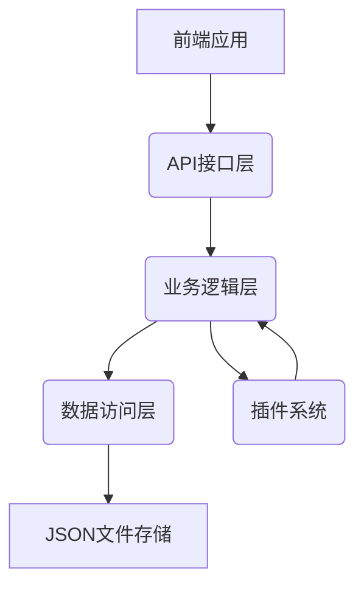
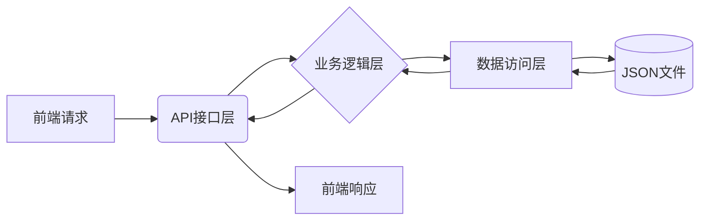
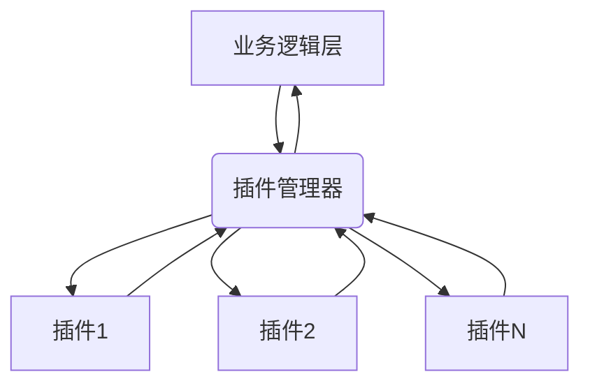

# TimeNest 课程表软件后端架构设计 (v2.0)

## 1. 概述

TimeNest 是一个面向班级授课大屏共用的课程表软件，旨在提供灵活的课程安排管理功能。本架构设计文档详细描述了 TimeNest 的后端架构，包括整体架构、模块划分、数据流设计、错误处理和日志记录策略等内容。

## 2. 整体架构设计

### 2.1 架构模式

TimeNest 采用分层架构模式，将系统划分为以下三个主要层次：

1. **数据访问层 (Data Access Layer)**: 负责与 JSON 文件存储进行交互，提供数据的持久化和检索功能。
2. **业务逻辑层 (Business Logic Layer)**: 实现核心业务逻辑，处理课程编辑、课程表管理、多周轮回课程表、临时换课等功能。
3. **API 接口层 (API Interface Layer)**: 提供统一的接口供前端调用，处理请求和响应。

### 2.2 技术选型

- **编程语言**: Python 3.8+
- **数据存储**: JSON 文件存储
- **依赖管理**: pip
- **其他库**: 
  - `json` (Python 标准库) - JSON 数据处理
  - `os`, `pathlib` (Python 标准库) - 文件系统操作
  - `logging` (Python 标准库) - 日志记录
  - `datetime` (Python 标准库) - 日期时间处理
  - `flask` (第三方库) - Web 框架，用于提供 HTTP API 接口

### 2.3 架构图



## 3. 模块划分

### 3.1 核心模块 (core/)

- `application.py`: 应用程序入口和主协调器
- `config.py`: 配置管理

### 3.2 数据访问模块 (data_access/)

- `course_repository.py`: 课程数据访问对象
- `schedule_repository.py`: 课程表数据访问对象
- `temp_change_repository.py`: 临时换课数据访问对象
- `storage_manager.py`: 存储管理器，负责 JSON 文件的读写操作

### 3.3 业务逻辑模块 (services/)

- `course_service.py`: 课程管理服务
- `schedule_service.py`: 课程表管理服务
- `temp_change_service.py`: 临时换课服务
- `cycle_schedule_service.py`: 多周轮回课程表服务

### 3.4 模型模块 (models/)

- `course.py`: 课程模型
- `schedule.py`: 课程表模型
- `temp_change.py`: 临时换课模型
- `cycle_schedule.py`: 循环课程表模型

### 3.5 插件管理模块 (plugins/)

- `plugin_manager.py`: 插件管理器
- `plugin_interface.py`: 插件接口定义

### 3.6 工具模块 (utils/)

- `date_utils.py`: 日期时间工具
- `validation_utils.py`: 数据验证工具
- `logger.py`: 日志工具

## 4. 数据模型设计

### 4.1 课程模型 (Course)

```json
{
  "id": "string",
  "name": "string",
  "teacher": "string",
  "location": "string",
  "duration": {
    "start_time": "HH:MM",
    "end_time": "HH:MM"
  }
}
```

### 4.2 课程表模型 (Schedule)

```json
{
  "id": "string",
  "day_of_week": "integer (0-6)",
  "week_parity": "string (odd/even/both)",
  "course_id": "string",
  "valid_from": "date",
  "valid_to": "date"
}
```

### 4.3 临时换课模型 (TempChange)

```json
{
  "id": "string",
  "original_schedule_id": "string",
  "new_course_id": "string",
  "change_date": "date",
  "is_permanent": "boolean",
  "used": "boolean"
}
```

### 4.4 循环课程表模型 (CycleSchedule)

```json
{
  "id": "string",
  "name": "string",
  "cycle_length": "integer",
  "schedules": [
    {
      "week_index": "integer",
      "schedule_items": [
        {
          "day_of_week": "integer (0-6)",
          "course_id": "string"
        }
      ]
    }
  ]
}
```

## 5. 数据存储设计

### 5.1 存储结构

```
data/
├── courses.json
├── schedules.json
├── temp_changes.json
├── cycle_schedules.json
└── config.json
```

### 5.2 数据访问策略

- 使用 `storage_manager.py` 统一管理所有 JSON 文件的读写操作
- 实现文件锁机制防止并发访问冲突
- 定期备份重要数据文件

## 6. 插件系统架构

### 6.1 插件接口

所有插件必须实现以下接口：

```python
class PluginInterface:
    def initialize(self, app_context):
        pass
    
    def execute(self, params):
        pass
    
    def cleanup(self):
        pass
```

### 6.2 插件管理

- `plugin_manager.py` 负责插件的加载、初始化和执行
- 支持热插拔，运行时可以动态加载/卸载插件
- 插件配置存储在 `plugins/` 目录下的配置文件中

## 7. 数据流设计

### 7.1 层间数据流



### 7.2 插件系统交互



## 8. 错误处理与日志记录

### 8.1 错误处理机制

- 定义统一的异常类层次结构
- 在各层之间传递有意义的错误信息
- 对于可恢复的错误，提供重试机制
- 对于不可恢复的错误，记录详细信息并安全退出

### 8.2 日志记录策略

- 使用 Python 标准库 `logging` 模块
- 日志级别: DEBUG, INFO, WARNING, ERROR, CRITICAL
- 日志输出: 文件和控制台
- 日志轮转: 每天生成新的日志文件，保留最近30天的日志

## 9. API 接口设计

### 9.1 课程管理接口

- `POST /courses` - 创建课程
- `GET /courses` - 获取所有课程
- `GET /courses/{id}` - 获取指定课程
- `PUT /courses/{id}` - 更新课程
- `DELETE /courses/{id}` - 删除课程

### 9.2 课程表管理接口

- `POST /schedules` - 创建课程表项
- `GET /schedules` - 获取所有课程表项
- `GET /schedules/{id}` - 获取指定课程表项
- `PUT /schedules/{id}` - 更新课程表项
- `DELETE /schedules/{id}` - 删除课程表项

### 9.3 临时换课接口

- `POST /temp_changes` - 创建临时换课
- `GET /temp_changes` - 获取所有临时换课
- `GET /temp_changes/{id}` - 获取指定临时换课
- `PUT /temp_changes/{id}` - 更新临时换课
- `DELETE /temp_changes/{id}` - 删除临时换课

### 9.4 循环课程表接口

- `POST /cycle_schedules` - 创建循环课程表
- `GET /cycle_schedules` - 获取所有循环课程表
- `GET /cycle_schedules/{id}` - 获取指定循环课程表
- `PUT /cycle_schedules/{id}` - 更新循环课程表
- `DELETE /cycle_schedules/{id}` - 删除循环课程表

## 10. 前端对接说明

### 10.1 接口调用方式

前端应用通过 HTTP 请求与后端进行通信，所有接口均采用 RESTful 设计风格。

### 10.2 数据格式

- 请求和响应数据均使用 JSON 格式
- 日期时间格式: ISO 8601 (YYYY-MM-DDTHH:MM:SS)
- 响应结构:
  ```json
  {
    "success": "boolean",
    "data": "object|array",
    "error": "string (可选)"
  }
  ```

### 10.3 认证与授权

- 系统设置管理密码保护
- 所有修改操作需要提供正确的管理密码
- 密码通过 HTTP Headers 传递

## 11. 集群控制预留接口

为适应学校范围内大范围部署的需求，系统预留以下集群控制接口:

- `POST /cluster/sync` - 同步数据到集群节点
- `GET /cluster/status` - 获取集群状态
- `POST /cluster/command` - 向集群发送命令

这些接口的具体实现将在后续版本中完成。

## 12. 总结

本架构设计为 TimeNest 课程表软件提供了一个清晰、可扩展的后端架构。通过分层设计和模块化划分，系统具有良好的可维护性和可扩展性。插件系统为未来功能扩展提供了灵活的支持，而详细的错误处理和日志记录机制确保了系统的稳定性和可调试性。